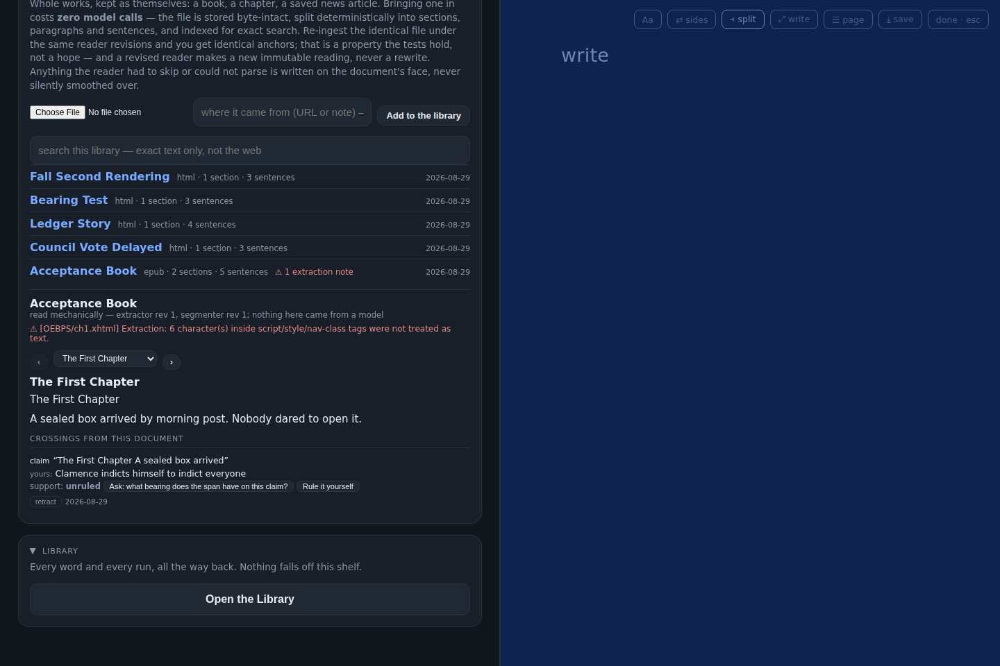
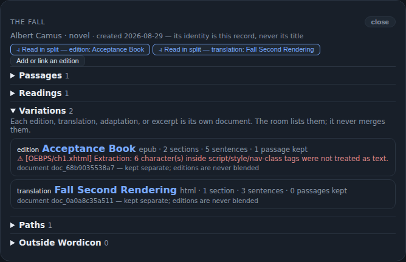
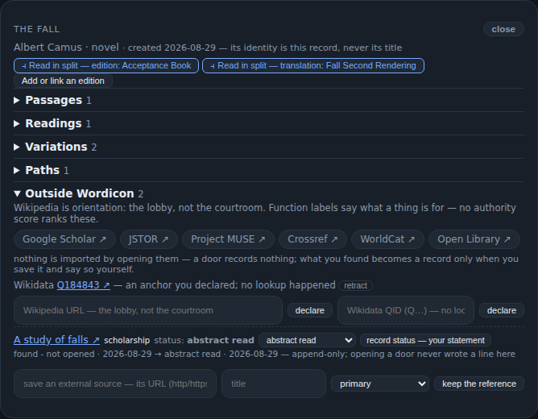
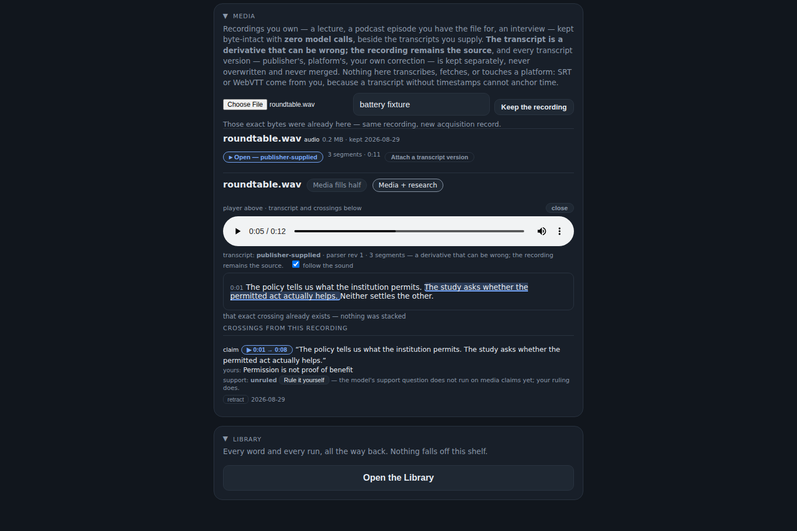
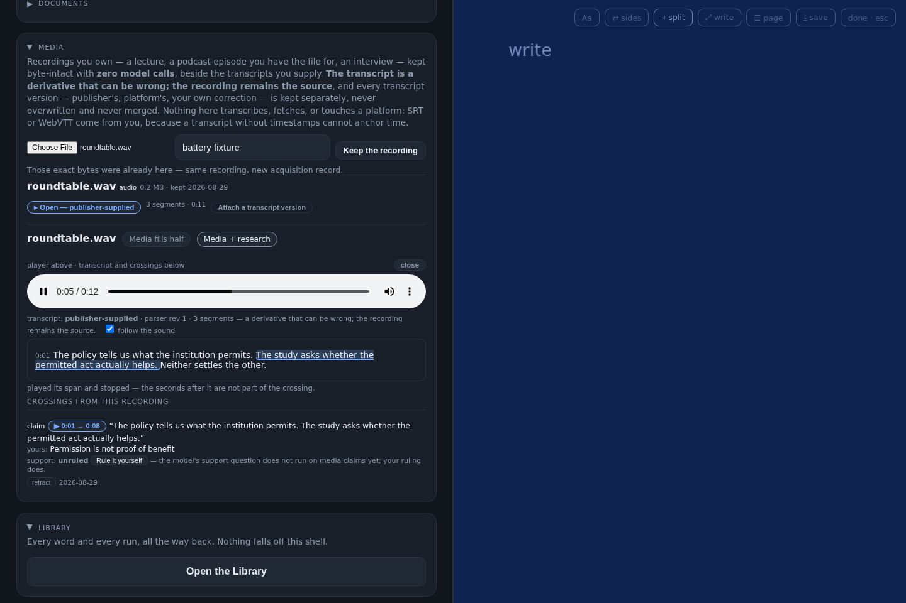
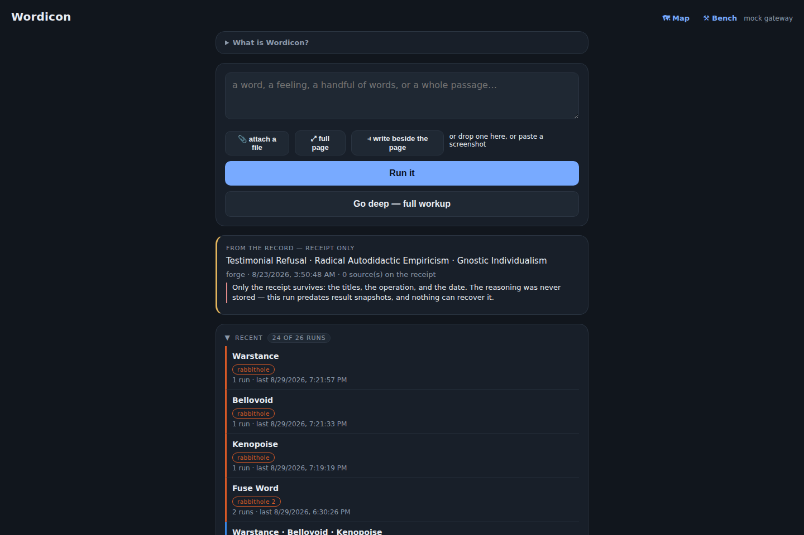

# Wordicon

A private, evidence-bearing workshop. Bring it a feeling with no name and it forges you
candidates worth arguing with. Bring it a book and the book stays a book — byte-intact,
mechanically read, every sentence an anchor you can hold a claim against. Bring it a
recording and the transcript scrolls under the sound, one click from any sentence to its
exact second. Coin a word at the Bench, cross a passage into evidence, walk the Map of
everywhere your thinking has been, enter a work the way you'd enter a room — and every
step leaves a record you can reopen, dispute, and re-rule, because in here **the record
is the product**.

It began as a word-coiner. The words turned out to be the smallest part.

Three laws hold everywhere in it: **the critic advises and never decides**; **anything
the tool isn't sure of says so** instead of quietly rounding up; and **nothing changes
without a visible choice** — no ruling recorded, no meaning rewritten, no check re-run
and no page reset except by a thing you clicked. Your ruling settles things, and only
your ruling, and you are allowed to change it — changes of mind are kept, never
overwritten.

## What it looks like

*All screenshots come from the automated verification batteries, run against a copy of
the real corpus.*

**Reading beside writing** — a document open in the split workspace, with a claim
crossed from an exact span. The claim is born `support: unruled`, because presence is
not support:



**A Work Room** — one work as a navigable place. Two editions linked as separate
variations (never blended), passages only from imported text, readings kept as accounts
*about* the work, never rendered as its words:



**The outside shelf** — Wikipedia as the lobby, not the courtroom. Six templated doors
that open searches and record nothing; a saved reference with an append-only access
history; a Wikidata QID declared by hand with no lookup:



**The media lane** — a recording you own beside the transcript you supplied. Click a
sentence and the player lands on its second; while it plays, the sentence under the
sound stays lit. The selected span became a time-anchored claim whose play button plays
only its seconds, then stops:



**A recording playing beside the writing room** — switching layouts or entering the
split restyles one element, so playback never stops:



**Honesty when the record is thin** — a run from before result snapshots existed shows
its receipt and names exactly what is unavailable. A door never opens onto an
unexplained blank:



## What is here, and what deliberately is not

This repository is the tool: server, web app, engines, tests, schemas, policies,
sanitized fixtures, and the constitution documents under `docs/`.

It is **not** the corpus. `local_state/` — every concept, judgment, document, recording,
crossing, and journal entry — lives only on the owner's machine and is ignored by git,
along with `.env` (API keys), generated reports, environments, and caches. A fresh clone
runs, but it runs *empty*; that is the boundary working, not a defect. The corpus
travels only through the tool's own export, which writes a checksum manifest so a copy
can prove it was not edited after the fact.

## Running it

```bash
python3 -m venv .venv && source .venv/bin/activate
pip install -r requirements.txt
cp /path/to/your/.env .   # ANTHROPIC_API_KEY=… and WORDICON_MODEL=…
python3 server.py
```

The server prints its port (default 8420) and binds `0.0.0.0`, so a phone on the same
Wi-Fi can open `http://<computer-ip>:8420` and install the page as a PWA. Model calls
happen only through lanes you explicitly invoke, on your own key; importing documents
and recordings, searching them, crossing spans, and ruling on claims are all
constitutionally zero-model and work with no key at all.

## The map of the machine

`scripts/wordicon_cli.py` is the oldest organ: the run engines (forge, crack, decompose,
sprout, refract, archetype), the Bone/Flesh/Friction layering, the judgment log, the Map
builder. `server.py` wraps it in Flask routes plus the newer wings. `scripts/library.py`
is the zero-model wing — documents kept byte-intact with deterministic anchors,
span crossings, the two-axis support question's mechanical half, the works registry, and
the media lane (versioned transcripts, time-anchored crossings). `webapp/` is the whole
interface: `index.html` (the page, the writing room, the split workspace, Documents,
Media, Sources, Work Rooms, Library), `overworld.html` (the Map and Wayfinder),
`trails.html` (runs as trails, every item a typed door), `bench.html` (reworking a kept
word). `src/wordicon_corpus/` holds the schema-validated corpus service; `schemas/` and
`config/` carry the data contracts and policy vocabularies it enforces.

## How it is tested, which is most of the point

```bash
python3 tests/test_global_constraints.py
```

One file, no framework, currently 88 blocks — and the discipline matters more than the
count. Invariants are enforced in code and then *attacked*: every capability ships with
sabotage mutations (silent truncation, smoothed transcripts, auto-linking, snapshot
testifying instead of retrieval, doors falling back to blank pages…), and a mutation the
suite survives is treated as a hole in the tests, not a pass. Two standing rules came
from wounds: pin exact expressions, because substring needles survive renames; and
**every rendered surface must prove its intended data arrived**, because the day two
routes claimed `/api/library`, the whole Library shelf rendered empty while the corpus
underneath was perfect. The constitution can be flawless while the wiring starves it —
so the wiring is tested too.

## Status

A private tool, built by its owner for its owner, with AI collaborators under standing
rules: every capability summoned, reversible, provenance-bearing, and attached to an
existing human gesture — and anything that learns from use may form *toward* the owner,
but must never form him silently. Publishing any portion of this is a separate, explicit
decision that has not been made.
