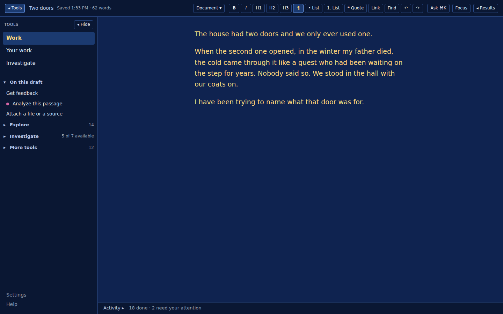
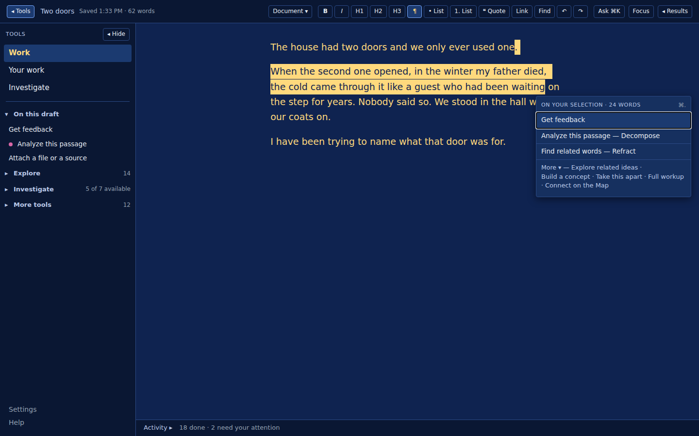
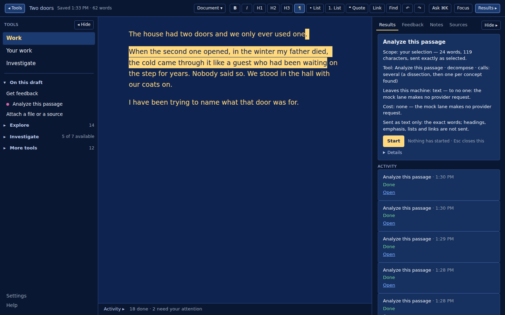
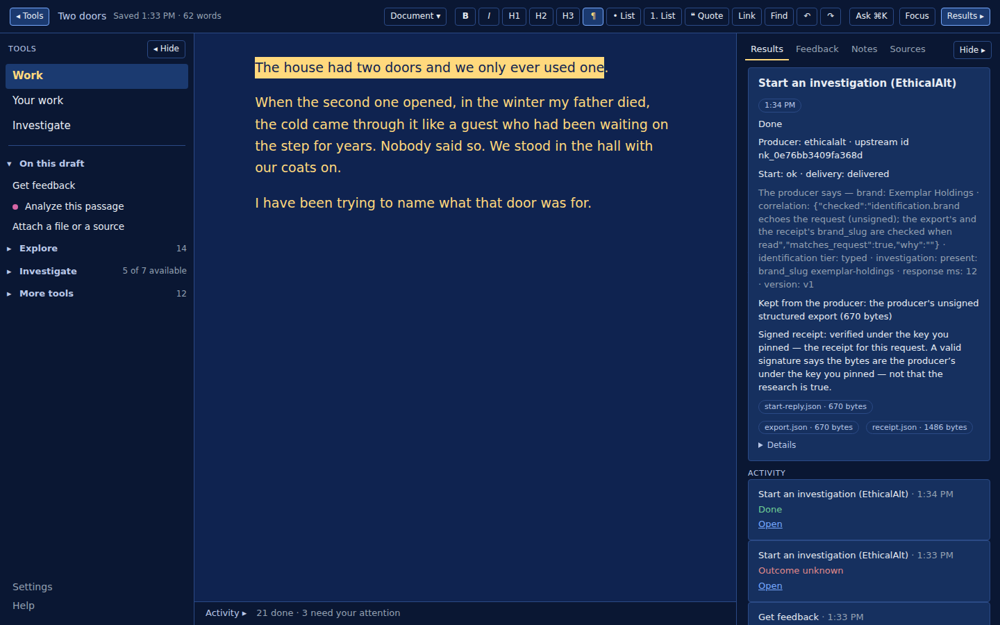
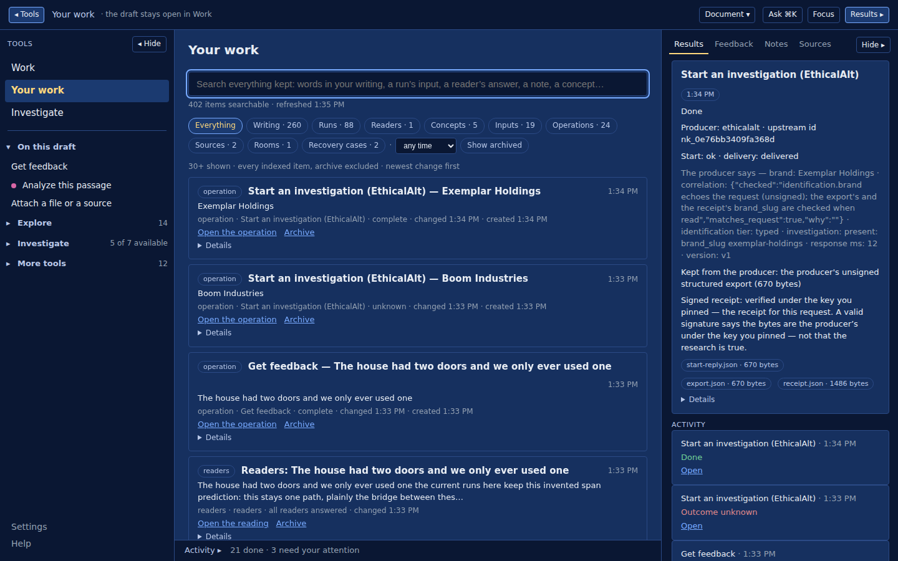
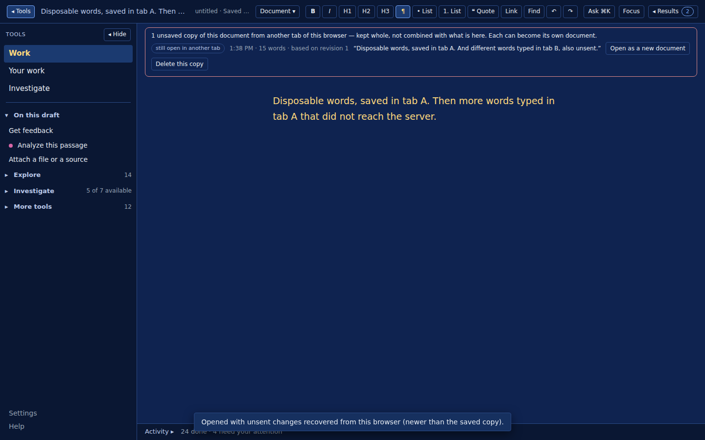
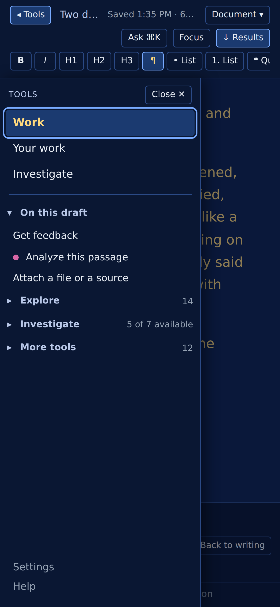

# Nikodemus

A private, local workshop for developing ideas beside your sources and your
writing — and a record of how you got there that you can reopen and argue with.

Bring it a feeling you have no word for and it forges concept readings worth
disputing: the idea's anatomy, under a plain working title. Bring it a book and
the book stays a book, byte-intact, every sentence an anchor a claim can be
held against. Bring it a recording and the transcript scrolls under the sound,
one click from any sentence to its second. Nothing is kept until you rule on
it, and **your ruling is the only thing that decides**.

Three laws hold everywhere in it:

- **The critic advises and never decides.** It objects; you rule; the objection
  and your ruling are both kept, even when they disagree.
- **Anything it isn't sure of says so** — a claim with no source says so rather
  than being rounded up to searched-and-found.
- **Nothing changes without a visible choice.** No ruling recorded, no meaning
  rewritten, no check re-run, except by something you clicked.

The binding text is the constitution, served at `/constitution` when the app is
running. It is versioned, and the test suite refuses to pass if a wing ships
without amending it.

## What it looks like

The writing workspace at `/work` (the beta, commit `fff87d3`): the draft on
the blue surface at paragraph width, Tools left, Results right, either side
hidden with a press. Nothing on the sides can insert or replace a word.



Select words and press ⌘. — the menu acts on exactly those words; nothing
has run yet.



Every action is a proposal first — what leaves this machine, to whom, at what
cost — and nothing runs until you press Start.



A result lands beside the draft, never in it, and says what it is — here a
producer's signed receipt, verified under the key you pinned: the bytes are
theirs, which is not the same as the research being true.



Your work searches everything kept — writing, runs, readers, concepts,
operations; every count names its population.



Another tab's unsaved words are listed above the draft, whole, never combined
with what is here.





The older desk at `/` (Write, Explore, Library, Bench) is still there. Every
image is the application on synthetic fixtures; the measured set, Chromium and
WebKit, is under [`docs/screenshots/workspace-v2/`](docs/screenshots/workspace-v2/index.json).

## What is built today

From [`docs/nikodemus-capability-census.md`](docs/nikodemus-capability-census.md)
— a read-only snapshot, not a promise:

A writing room; a forge that decomposes a passage into components and judges
each one; a Library that keeps documents byte-intact and reads five formats
without OCR; a Clinic where authorities stay separate; an Investigation Room
that pulls from Open Case and EthicalAlt without merging them; Inquiry; a
Bench for coinage when you want one; a Keeper with custody but no authority; an
encrypted Vault that restores a verified past and regrows nothing; a Map of
where the thinking has been; Speak, which hears what you deliberately say to
it and transcribes nothing on its own; three readers who read the text the
room holds and answer apart; and Find related words — synonyms, antonyms,
Latin and Ancient Greek with their periods, other languages — each result
carrying Explore, Compare, Save and Check sources.

Two rules held everywhere:

- **What was acquired is said apart from what the model concluded.** A word
  looked up in reference sources reports what the provider actually returned
  first, and the model's finding second, as the model's own. A source the
  model names stays "named by the model", and nothing in that lane wears a
  proof-style badge.
- **Your prose is taken whole or refused by name — never cut.** What you
  write reaches the record, the job and the prompt exactly as written, or is
  refused before any of those exist, with the field, the count and the limit
  stated. What still shortens is a label or a preview, and the suite pins
  that list by line.

Boundaries worth knowing before you judge it:

- It does not claim to beat a plain prompt; the bench for that question has
  not answered it.
- Provider search results are **leads**, not verification. A claim is verified
  only when a source is admitted through Nikodemus and tied to an exact anchor.
- Six judgments in the record were made by a model, not the owner, and are
  marked as such rather than quietly counted.
- Single-owner and local. No multi-user model; the LAN gate is an access lock,
  not encrypted transport.

## Run it locally

Python 3.13+. The app makes real model calls and they cost money.

```
python3 -m venv .venv
source .venv/bin/activate
pip install -r requirements.txt
python server.py
```

There is no `.env.example` to copy. Create `.env` yourself with the two lines
the server reports on startup:

```
ANTHROPIC_API_KEY=your-own-key
WORDICON_MODEL=your-model-slug
```

It serves on `http://127.0.0.1:8420`, loopback only; `WORDICON_LAN=1` opens it
to your own network with a pairing code for a phone. Jobs run in the
background: the terminal and the machine must stay awake for a run to finish.

Without an API key it still runs — the offline gateway is deterministic and
proves the pipeline rather than the prose.

## First use

Open `/work` and write a paragraph. Select some of it, press ⌘., pick Get
feedback or Analyze this passage, read the proposal, press Start. What comes
back is a set of readings, each with its anchor in your text, a craft
objection from the critic, and a check on whether the anchor licenses the
claim. Nothing is saved until you rule. Find it again under Your work.

To try a candidate build without touching your data: `python3 scripts/preview.py`
serves it on its own empty root (fixtures, port 8421); `--from <state root>`
serves a consistent copy of an existing store instead.

## How its claims work

Four things are kept apart on purpose, and the interface never merges them:

- **The source** — what you admitted, byte-intact, with an exact anchor.
- **The proposal** — what the model wrote. Never treated as your conclusion.
- **The critic** — an objection on craft, plus a separate mechanical check on
  whether the quoted span supports the claim. Advisory. Never a gate.
- **Your ruling** — the only thing that settles anything. Append-only, so
  changes of mind are kept rather than overwritten.

Every run leaves a receipt under its own trace id, and every real request it
made is recorded — component, stage, duration, what came back, whether it
failed. A partial run says so first, and no count speaks for components that
never ran.

## Documentation

[`docs/README.md`](docs/README.md) is the complete index, grouped by purpose.
The three worth opening first:

- [`docs/CHANGELOG.md`](docs/CHANGELOG.md) — every block, what it repaired, and
  what it refused to do. The most honest account of how this got here.
- [`docs/epistemic-contract.md`](docs/epistemic-contract.md) — what it may
  assert and on what basis.
- [`docs/nikodemus-capability-census.md`](docs/nikodemus-capability-census.md)
  — what exists, read-only, at one commit.

## How it is tested

`python3 tests/test_global_constraints.py` — one suite of behavioural pins,
each named for the defect it prevents rather than the function it calls. It
reports three outcomes: pass, fail, and **skipped**, because a check that did
not run is not a check that passed.

`bash tests/journeys/run.sh` — browser journeys in real Chromium and WebKit
(never substituted), for what source review cannot see: rendered order,
whether text is really text, where the caret lands, what a page actually sends.

Pins are sabotaged deliberately: break the behaviour, confirm the pin fails
**by name** rather than by crashing. A check that cannot fail is not a check.

## History and legacy names

Nikodemus was **Wordicon** until 2 September 2026
([`docs/adr-nikodemus.md`](docs/adr-nikodemus.md)). The record keeps the name
it was written under — nothing was rewritten to make the new name look older
than it is.

The legacy name is still the real name of real things, and deliberately so:
the repository is `wordicon`, the CLI is `scripts/wordicon_cli.py`, the model
environment variable is `WORDICON_MODEL`, the LAN flag is `WORDICON_LAN`, and
the package is `src/wordicon_corpus/`. Those are not branding oversights. A
name is a handle, never the thing, and renaming a working command to tidy a
logo is how a setup guide starts lying.
