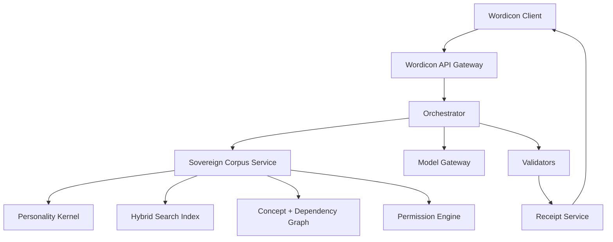

# Wordicon Sovereign Corpus

## Complete Product and Technical Blueprint — v1.2 (consolidated, canonical)

**Supersedes:** v1.0 (base architecture) and the v1.1 synthesis addendum (revocation, derived-constraint, permission-profile, rejection-capture amendments). Those two documents are retained as change history in `CHANGELOG.md`; this file is the single authoritative specification. Where v1.0 and the Gemini exchange that prompted v1.1 disagreed, v1.0's stricter trust-zone boundaries win unless a specific amendment below says otherwise.

**Audience:** Product designer, software architect, AI engineer, data engineer, security reviewer, and implementation agent.

**Purpose:** Define how Wordicon can use a privately owned, model-independent intellectual corpus — composed of the owner's conversations, documents, accepted concepts, rejected language, source materials, and judgment history — without surrendering that property to a public product or an AI vendor, and without that property silently going stale when its own sources are edited or revoked.

**Core rule:**

> **Train the method cautiously. Retrieve the property selectively. Never surrender the container.**

**Status of this version:** Phase 0/Phase 1 artifact. This document, its schemas, its ADRs, and one mocked vertical slice are authorized. Full corpus ingestion, a public interface, a vector database, fine-tuning, and external-model integration are **not** authorized by this document and require separate sign-off (see §23).

---

# 1. Executive summary

Wordicon is a bidirectional meaning engine. It can:

1. **Crack** an existing word into documented history, semantic change, symbolic potential, and cultural risk.
2. **Forge** candidate language for an experience that lacks a satisfactory name.

The public-facing result has three default layers:

- **Bone:** documented linguistic, historical, scientific, or cultural material;
- **Flesh:** symbolic synthesis, definition, contradiction, archetype, and poetic extension;
- **Friction:** hostile critique, redundancy checks, distortion warnings, and cultural risk.

Every output carries a **Receipt** identifying what was documented, inferred, invented, rejected, and derived from private material.

Wordicon's distinctive intelligence does not reside principally in a general-purpose language model. It resides in a separate, privately controlled property called the **Sovereign Corpus** — a name chosen over alternatives considered during design (Black Library, Private Canon, Vault, Temperament Engine, Nikodemus Corpus) because it names the ownership claim without collapsing the corpus into either pure containment ("Vault") or the kernel alone ("Temperament Engine"). This corpus contains:

- the owner's original writing;
- long-running AI conversations;
- canonical Wordicon entries;
- rejected candidates and reasons for rejection;
- preferred thinkers, artists, historical figures, criminals, clinicians, theories, myths, and scientific mechanisms;
- curated public or licensed references;
- stylistic prohibitions and negative examples;
- a graph of concepts, relationships, and **dependencies** (§13a);
- a compact Personality Kernel derived from repeated judgments;
- a set of **Derived Constraints** — natural-language rules extracted from private material that may leave the vault while their sources never do (§4.1, §6a).

The model is replaceable. The corpus, annotations, graph, tests, and judgment history are the durable intellectual property — but only if that property has a real lifecycle: version history, provenance, and **revocation that actually reaches everything built from it**, not just its most direct citations. That lifecycle is the main addition in this version.

The recommended architecture is **retrieval-first hybrid intelligence**:

- private corpus remains in owner-controlled storage;
- a private API receives constrained Wordicon requests;
- retrieval selects only relevant corpus objects;
- a small Personality Kernel supplies stable governing tendencies;
- a model produces structured candidate outputs;
- deterministic validators verify source support, permissions, and receipt completeness;
- only approved derived material leaves the private boundary;
- every derived artifact (constraint, kernel version, chamber summary) tracks what it depends on, so that revoking a source invalidates everything built from it instead of leaving stale derivatives in circulation;
- optional future fine-tuning teaches nonsecret decision patterns, not the raw secret corpus.

---

# 2. Non-negotiable design principles

## 2.1 Separate product from property

Wordicon is the application. The Sovereign Corpus is a separately owned intellectual asset. The public product may consult the corpus through an explicit, revocable license enforced by API policy. It does not acquire ownership, unrestricted access, or the right to train on the corpus merely because it can request derived results.

## 2.2 The corpus must remain model-independent

No model vendor, embedding vendor, database vendor, or application framework should become the only usable representation of the corpus. Canonical data must remain exportable in ordinary formats: UTF-8 Markdown, JSON/JSONL, YAML, CSV/TSV, open database dumps, documented media manifests. Embeddings and fine-tuned weights are disposable indexes, not canonical property.

## 2.3 A language model is not the source of truth

The model may synthesize, compare, compress, and propose. It may not establish a Bone claim merely from pretrained memory. Every factual Bone claim must cite one or more admitted corpus sources, identify claim type, carry a confidence assessment, disclose material disagreement, and comply with the source's permission policy. If no admitted source supports the claim, the system must move it to Flesh as explicitly speculative, quarantine it for research, or omit it.

## 2.4 Private influence must not imply private disclosure

The system may derive a constraint such as *"Avoid automatic redemption after injury"* without exposing the private conversation that produced that judgment. This is now formalized as a first-class object (§4.1, §6a) rather than a transient string, precisely so the constraint can be cited, versioned, and revoked without ever exposing its source.

## 2.5 Verification is not adjustable

Users may adjust creative or adversarial intensity. They may not lower the evidentiary standard for Bone.

## 2.6 The Receipt is constitutional

No final result is complete without a machine-readable receipt, even when the interface shows only a compact summary. Historical receipts are never silently rewritten — see §15.6a.

## 2.7 Refusal is a valid output

The engine must be able to conclude: an existing word already suffices; the proposed concept is not distinct; the evidence is inadequate; the requested metaphor trivializes a historical trauma; the output would be decorative rather than useful; the material is not licensed for the requested use.

## 2.8 Derived artifacts are only as trustworthy as their revocation path (new in v1.2)

Anything built *from* a private source — a Derived Constraint, a Personality Kernel version, a chamber summary — inherits that source's fragility. If the source is later found to be wrong, withdrawn, or simply no longer something the owner wants influencing output, every derived artifact that depended on it must become invalid or review-required automatically. A corpus that can revoke a citation but not the kernel built from it has not actually implemented revocation — it has implemented the appearance of revocation. See §13a.

---

# 3. System boundaries and trust model

## 3.1 Principal components



**Wordicon Client** — the user-facing application. Never receives unrestricted corpus access.

**Wordicon API Gateway** — authenticates requests, applies rate limits, records purpose, forwards only valid operations.

**Orchestrator** — controls the multi-stage workflow: what to retrieve, which model tasks to run, which validators must pass, what may be returned.

**Sovereign Corpus Service** — the sole authorized interface to private intellectual property: ingestion, search, graph traversal, permissions, derivation, source identities, revocation.

**Model Gateway** — a replaceable adapter for local or hosted models. Enforces vendor-specific privacy settings, output schemas, timeouts, egress policy.

**Validators** — deterministic or independently modeled checks for citations, permissions, unsupported claims, style failures, cultural risks, schema validity.

**Receipt Service** — creates private forensic receipts and redacted public receipts from the complete execution trace, and appends revocation annotations without mutating historical receipts.

## 3.2 Trust zones

- **Zone A — Owner-only vault.** Raw conversations, private documents, sensitive annotations, master keys. No public service has direct database credentials.
- **Zone B — Private processing.** Retrieval, graph, policy, and local-model services. Raw corpus objects may be processed here according to their permissions.
- **Zone C — Controlled model egress.** Only selected excerpts or derived constraints may be sent to an external model. Every outgoing item is logged and permission-checked.
- **Zone D — Public product.** Receives only approved outputs and public/redacted receipts.

(Gemini's parallel description of this system used a flat four-box diagram with no zone boundaries. That framing is not adopted here — the zone model is load-bearing for the security posture and should not be simplified away.)

---

# 4. The Sovereign Corpus model

The corpus is a structured collection of source objects, concept objects, judgment objects, relationship objects, derived-artifact objects, and policy objects — not a pile of files.

## 4.1 Corpus object types

- **Source** — a document, conversation, book note, article, image, recording, transcript, historical reference, or licensed excerpt.
- **Fragment** — a bounded passage extracted from a source with precise provenance.
- **Claim** — a factual proposition supported or challenged by fragments.
- **Concept** — a Wordicon entry or candidate concept.
- **Mechanism** — a reusable structural pattern (e.g. *institution denies passage*, *protection becomes captivity*, *repair mechanism attacks the organism*).
- **Judgment** — a decision that an output, phrase, analogy, or conceptual move was accepted, rejected, revised, or left unresolved.
- **Style example** — an accepted or rejected sample labeled with the reasons it succeeds or fails.
- **Person or tradition card** — a structured account of a thinker, artist, criminal, clinician, religious figure, movement, school, or tradition.
- **Permission policy** — rules determining whether an object may be retrieved, quoted, summarized, transformed, displayed, or used in training.
- **Graph edge** — a typed relationship between objects, now generalized to a full dependency graph (§13a).
- **Derived Constraint** *(new object type, v1.2)* — a natural-language rule extracted from one or more private sources, with its own ID, provenance, materiality, review status, and revocation lifecycle. See §4.6 for schema.
- **Personality Kernel version** *(formalized as an object type, v1.2)* — an immutable, versioned snapshot of governing tendencies. Never edited in place; superseded by a new version after review. See §6.
- **Chamber summary** *(formalized as an object type, v1.2)* — a versioned, regenerable hierarchical summary of a corpus chamber, used for corpus-wide influence without corpus-wide exposure (§8.4). Subject to the same dependency tracking as a Derived Constraint.
- **Revocation event** *(new object type, v1.2)* — an immutable record of a revocation: what was revoked, when, by whom, and what it invalidated. See §13a.5.

## 4.2 Recommended canonical schema (Source)

```json
{
  "id": "src_personal_000142",
  "object_type": "source",
  "title": "Conversation on Ulcerian Defiance",
  "created_at": "2025-11-29T00:00:00Z",
  "provenance": {
    "origin": "personal_ai_conversation",
    "author": "owner",
    "external_participants": ["assistant"],
    "original_file_hash": "sha256:..."
  },
  "epistemic_class": "personal_authority",
  "sensitivity": "private",
  "permissions_profile": "private_raw",
  "permissions": {
    "retrieve_raw": ["owner_local_processing"],
    "send_to_external_model": false,
    "derive_constraints": true,
    "quote_in_private_receipt": true,
    "quote_in_public_receipt": false,
    "use_for_training": false
  },
  "permission_overrides": [],
  "tags": ["resistance", "medical_metaphor", "institutional_power"],
  "version": 1
}
```

`permissions_profile` names which preset (§4.5a) populated the granular `permissions` block; `permission_overrides` records any per-object exception, each with a reason, prior value, new value, curator, and timestamp (§4.5a). The granular flags remain the actual enforcement surface — the profile is an administrative convenience, not a replacement.

## 4.3 Epistemic classes

| Class | Meaning |
|---|---|
| External factual authority | May support Bone claims within scope |
| Primary historical source | Direct evidence requiring contextual interpretation |
| Secondary scholarship | Interprets primary evidence |
| Personal authority | Authoritative about the owner's own concepts or preferences |
| Creative source | May inspire Flesh but not factual claims |
| Speculative framework | May structure interpretation with explicit qualification |
| Negative example | Teaches prohibited or failed behavior |
| Quarantined research | Not admitted to Bone until reviewed |

## 4.4 Sensitivity classes

- **Public** — may appear in public results and receipts.
- **Internal** — usable by the system but not exposed as raw material.
- **Confidential** — excerpts may be used only under restricted processing.
- **Private raw** — remains inside owner-controlled processing.
- **Derived only** — raw text may never leave; only reviewed abstractions may be returned.
- **Sealed** — retained but never automatically retrieved.

## 4.5 Use permissions (granular, machine-enforced)

- retrieve raw; retrieve summary; derive constraints; send excerpt to local model; send excerpt to external model; quote privately; quote publicly; transform creatively; use for evaluation; use for fine-tuning; share with collaborators; export.

Default must be deny.

## 4.5a Permission profiles (human-facing preset layer, new in v1.2)

Hand-setting twelve booleans per object does not scale past a handful of sources, and that friction is exactly what causes a builder to start taking shortcuts on default-deny. Profiles are named presets that populate every granular flag at once; they are **not** an ordinal ladder — "training permitted" is not a higher version of "public attribution," and "derived only" behaves nothing like "private raw." Each is an independent bundle of capabilities. See `config/permission-profiles.yaml` for the full flag table.

Profiles: `private_raw`, `private_retrieval`, `derived_only`, `constraint_text_external_approved`, `private_citation`, `public_source`, `training_approved`, `sealed`. `constraint_text_external_approved` (added in v1.2.1) is scoped exclusively to Derived Constraint objects — never assignable to a Source, enforced at ingestion — and exists so a reviewed constraint's resolved text can be sent to an approved external vendor per ADR-002 without loosening `derived_only`'s guarantee that the Source's raw text never leaves under any profile.

An object may override its profile only through a recorded exception: changed flag, prior value, new value, reason, curator, timestamp. Default profile is `sealed` or `private_raw` depending on ingestion route. `training_approved` is never inferred — it requires explicit curator action.

The owner console should render a plain-language preview for whichever profile is selected, e.g.: *"Under this profile, this source may be processed locally and used to derive constraints, but its raw text may not be sent to an external model, quoted publicly, or used for training."*

## 4.6 Derived Constraint schema (new in v1.2)

```json
{
  "id": "dc_000091",
  "object_type": "derived_constraint",
  "text": "Do not romanticize survivor guilt.",
  "derived_from": [
    {
      "object_id": "src_personal_000142",
      "relationship": "derived_from",
      "materiality": "essential"
    }
  ],
  "derivation_method": "curator_authored",
  "review_status": "approved",
  "sensitivity": "derived_only",
  "permissions_profile": "derived_only",
  "valid_from": "2026-08-18T00:00:00Z",
  "valid_until": null,
  "supersedes": null,
  "superseded_by": null,
  "kernel_membership": ["kernel_v1"],
  "chamber_summary_membership": [],
  "reused_in_operations": ["trace_..."],
  "version": 1
}
```

`materiality` on each dependency edge is one of:

- **essential** — revoking the source invalidates the constraint outright.
- **supporting** — revoking the source lowers confidence and queues review, but does not immediately invalidate.
- **historical** — retained for lineage; not required for the constraint's continued validity.

The private `derived_from` chain (source IDs) belongs in the forensic receipt only. A public receipt may disclose that a proprietary derived constraint influenced the output — never which source produced it.

---

# 5. Corpus chambers

(Unchanged from v1.0 — see §5.1–§5.9: Personal corpus; Language and etymology; Clinical and psychological material; Medicine, anatomy, and pathology; Natural science; Myth, religion, folklore, and superstition; History and institutional power; Thinkers, artists, and figures; Anti-corpus. Every chamber-level summary used for retrieval is now a versioned, dependency-tracked object per §13a rather than an unversioned cache.)

---

# 6. The Personality Kernel

The full corpus should not be retrieved on every request. A compact, versioned Personality Kernel is loaded for every operation authorized to use the owner's intellectual temperament.

## 6.1 What the kernel contains

Stable conceptual preferences, epistemic rules, recurring mechanisms, style constraints, prohibited habits, preferred tensions, known disagreement patterns, output standards, privacy rules, and pointers to high-priority corpus objects — including, as of v1.2, an explicit list of the Derived Constraints that compose it (`kernel_membership` on each constraint, mirrored as a member list on the kernel object).

## 6.2 What the kernel must not contain

A clinical personality diagnosis; unnecessary autobiographical detail; full private conversations; claims that the owner is permanently defined by a past preference; private material not needed to govern outputs.

## 6.3 Kernel derivation and immutability (amended in v1.2)

The kernel is initially hand-authored. The system may later propose updates from repeated judgments, but no update becomes canonical without owner approval.

**Kernel versions are immutable.** A kernel version is never edited in place. If a source underlying `kernel_v1` is revoked and that dependency was essential, `kernel_v1` is marked `invalid` and stops serving new requests — it is not silently patched. A new `kernel_v2` is created only after owner review, with an explicit record of what changed and why. This mirrors ordinary object versioning (§7.1 step 10) but is stated explicitly here because kernels were the clearest gap identified in the v1.1 review: without immutability plus revocation propagation, a kernel could keep operating on a judgment whose source no longer exists in the vault, with nothing in the system flagging that fact.

```yaml
kernel_version: 1
status: approved
principles:
  - prefer mechanism over moral labeling
  - preserve ambiguity without disguising factual uncertainty
  - do not force redemption
  - permit grotesquerie only when it reveals structure
  - distinguish clinical analogy from diagnosis
style:
  favor:
    - weary clarity
    - aphoristic compression
    - dark and tender coexistence
    - bodily and institutional mechanisms
  reject:
    - generic mystical reassurance
    - decorative profundity
    - automatic transcendence
required_checks:
  - historical provenance
  - shadow expression
  - redundancy with existing concepts
  - cultural extraction risk
member_constraints:
  - dc_000091
```

---

# 7. Ingestion and curation pipeline

## 7.1 Intake stages

1. **Acquire** — receive a document, conversation export, note, reference, media file, or manual entry.
2. **Hash** — calculate a content hash and preserve original bytes.
3. **Classify** — identify origin, ownership, copyright status, sensitivity, and epistemic class.
4. **Parse** — extract text, metadata, headings, timestamps, participants, media references.
5. **Segment** — create meaningful fragments with source locators.
6. **Annotate** — assign themes, mechanisms, figures, historical periods, candidate relationships.
7. **Set permissions** — apply a permission profile (§4.5a), default deny, then explicit per-object overrides only with a recorded exception.
8. **Review** — human approval for canonical admission.
9. **Index** — create lexical, semantic, and graph indexes.
10. **Version** — record every change without destroying prior states.

## 7.2 Conversation ingestion

AI conversations are unusually valuable because they contain decisions, not merely prose. The parser should detect user-originated phrases, assistant proposals, explicit acceptance, explicit rejection, revision requests, preference statements, canonicalization language ("save this"), unresolved speculation, and later contradictions. Acceptance must never be inferred solely because the user continued the conversation; confidence in inferred judgments remains low until reviewed.

## 7.3 Copyright and licensing

Every external source carries a rights record: public domain; openly licensed; licensed commercial reference; personally owned copy with limited computational use; quotation-only; metadata-only; prohibited. Do not ingest entire copyrighted manuals or books into a commercial system without a legitimate license — the DSM is a specific example requiring licensing review.

---

# 8. Retrieval architecture

## 8.1 Retrieval stages

Parse the request into operation and conceptual features; apply the Personality Kernel; retrieve exact lexical matches; retrieve semantic neighbors; traverse graph relationships; retrieve relevant accepted and rejected examples; retrieve cultural and permission warnings; rerank by purpose, authority, recency, and personal relevance; apply permissions and egress policy; construct a minimal context package.

## 8.2 Hybrid retrieval

Full-text search for exact terms; embeddings for conceptual similarity; graph traversal for typed relationships; metadata filters for chamber, authority, sensitivity, permission; curated pinning for canonical sources; negative retrieval for anti-corpus matches.

## 8.3 Context package

```json
{
  "operation": "forge",
  "kernel_version": 1,
  "input": "guilt produced by escaping a system that still contains people you love",
  "bone_materials": [],
  "governing_constraints": [],
  "personal_mechanisms": [],
  "accepted_examples": [],
  "rejected_examples": [],
  "cultural_warnings": [],
  "output_contract": {},
  "receipt_trace_id": "trace_..."
}
```

`governing_constraints` (added in v1.2, matching the shape demonstrated in the Gemini exchange) carries resolved Derived Constraint text only — never the `derived_from` source pointers, which stay in the forensic trace.

## 8.4 Corpus-wide influence without corpus-wide exposure

The always-loaded Personality Kernel; hierarchical, versioned chamber summaries; graph-centrality signals; retrieval of relevant exemplars; periodic owner-approved kernel updates; evaluation against the full rejection corpus after generation. This captures global temperament without sending every private document into each model context — and, as of v1.2, without those summaries silently going stale when a source they were built from is revoked (§13a).

---

# 9. Model strategy

## 9.1 Recommended sequence

**Stage 1 — Prompted structured generation.** Strong general model, strict schemas, private retrieval, deterministic validators.

**Stage 2 — Local or dedicated models for sensitive operations.** Local inference for private-raw sources and derived-only material when external egress is prohibited.

**Stage 3 — Optional fine-tuning**, only on synthetic examples, de-identified decision patterns, approved accepted/rejected pairs, nonsecret style constraints, schema compliance — never the raw private corpus by default, and never before the retrieval system is stable (Phase 8).

## 9.2 Why not train first

Weak provenance; difficult deletion; extraction risk; costly updates; model lock-in; uncertain memorization; inability to distinguish owner-authored material from assistant text.

## 9.3 Model roles

Request interpreter; retriever planner; Bone claim drafter; Flesh synthesizer; hostile critic; cultural-risk reviewer; style auditor; citation verifier; final compositor. The hostile critic must not see itself as obligated to approve the concept.

---

# 10. Wordicon operation pipeline

## 10.1 Crack

Normalize the word; identify language, morphology, homonyms; retrieve admitted lexical and historical sources; identify semantic drift and popular etymologies; retrieve personal symbolic associations separately; draft Bone claims with citations; generate labeled Flesh interpretations; run Friction for distortion, appropriation, and etymological fallacy; validate every Bone claim; produce result and Receipt.

## 10.2 Forge

Parse the unnamed experience into mechanisms, tensions, agents, temporal structure, emotional register; run **Already Named** across existing language and the personal concept graph; if a sufficient word exists, present it as the benchmark; if a gap remains, generate candidates from permitted linguistic materials; score semantic fit, phonetic fit, distinctiveness, personal resonance, distortion risk, redundancy, unsupportedness; generate definitions and construction notes; run Hostile Read; reject candidates that fail thresholds; present a small candidate set; record user judgment.

**Rejection capture (formalized in v1.2, §10.2a):** every rejected candidate automatically becomes an unreviewed negative Style example and an unreviewed Judgment object — it does not require separate curator action to be captured, only to be promoted.

## 10.2a Rejection capture, formalized

Every candidate rejection creates, without additional action:

- a Judgment object recording the rejected candidate, the originating operation, the concept it attempted to name, the rejection source (owner, curator, validator, or model critic), the rejection reason, a confidence score, and which axis it failed on (style, factuality, redundancy, cultural risk, or conceptual weakness);
- a staged, unreviewed negative Style example.

Unreviewed negative examples sit in a staging index and **do not** influence canonical anti-corpus retrieval until reviewed — this mirrors the existing rule that acceptance is never inferred from a conversation simply continuing (§7.2). The system must also distinguish *"I reject this candidate for this concept"* from *"I reject this form everywhere"* — a word can fail locally without becoming a universal style prohibition; only a reviewed, generalized judgment does that.

## 10.3 Crossbreed

Analyze both source concepts independently; identify structural rather than superficial correspondences; generate collision mechanisms; reject candidates based only on sound or cleverness unless the user explicitly requests comic wordplay; preserve provenance for both parents.

---

# 11. Bone, Flesh, and Friction output contract

```json
{
  "title": "The Refusenik Posture",
  "bone": { "summary": "...", "claims": ["claim_001", "claim_002"] },
  "flesh": { "definition": "...", "central_contradiction": "...", "archetypal_frame": ["..."], "axiom": "..." },
  "friction": { "hostile_read": "...", "cultural_risks": ["..."], "redundancy": "...", "verdict": "provisional" },
  "receipt_id": "receipt_..."
}
```

---

# 12. Receipt architecture

## 12.1 Receipt types

**Summary receipt** (visible by default): e.g. *"7 sources · 4 interpretive operations · 2 rejected candidates · 1 cultural warning."*

**Full private receipt** (owner only): input, operation, exact source objects and fragments, claims and confidence, private corpus influences (including which Derived Constraints fired and their `derived_from` chains), transformation chain, model calls, alternatives, rejections, warnings, equations and scores, versions.

**Public receipt**: public sources; factual versus interpretive labels; confidence; disclosed warnings; a statement that a proprietary derived constraint or interpretive system contributed; no private fragments or sensitive source identities. Never a private source ID, title, fragment text, or conversation excerpt, even redacted or partially — the boundary is exclusion, not obfuscation.

## 12.2 Receipt schema

```json
{
  "receipt_id": "receipt_01J...",
  "trace_id": "trace_01J...",
  "created_at": "...",
  "operation": "forge",
  "input_hash": "sha256:...",
  "kernel_version": 1,
  "engine_version": "0.1.0",
  "sources": [{ "source_id": "src_...", "fragment_id": "frag_...", "use": "supports_claim", "visibility": "private", "egress": "derived_only" }],
  "derived_constraints_applied": [{ "constraint_id": "dc_...", "kernel_version": 1, "visibility": "private" }],
  "claims": [{ "claim_id": "claim_...", "text": "...", "type": "historical", "confidence": 0.94, "supporting_fragments": ["frag_..."] }],
  "transformations": [],
  "candidates": [],
  "rejections": [],
  "warnings": [],
  "model_calls": [],
  "revocation_annotations": [],
  "redaction_policy": "public_v1"
}
```

`revocation_annotations` (new in v1.2) is appended-only: if a source or derived constraint used in this receipt is later revoked, an annotation is added here — the rest of the receipt is never rewritten (§13a.4).

## 12.3 Receipt invariants

Every Bone sentence maps to at least one claim. Every factual claim maps to an admitted fragment. Every private fragment has an egress decision. Every final candidate records rejected alternatives. Every mathematical score records its components and weights. Public receipts are generated from private receipts, never independently reconstructed. **Historical receipts are annotated on revocation, never silently mutated (new invariant, v1.2).**

---

# 13. Mathematical layer

(Unchanged from v1.0.) For candidate word \(w\), user description \(x\), Sovereign Corpus \(C\), Personality Kernel \(K\):

\[
w^* = \arg\max_{w \in W}\left[\alpha S_{sem}(w,x) + \beta S_{phon}(w,x) + \gamma S_{dist}(w,C) + \delta S_{pers}(w,K) - \lambda R_{hist}(w,C) - \mu R_{red}(w,C) - \nu R_{unsup}(w) - \xi R_{orn}(w,K)\right]
\]

Claim support: \(Q(c) = 1 - \prod_{i=1}^{n}(1 - a_i r_i e_i)\), with authority weight \(a_i\), fragment relevance \(r_i\), entailment strength \(e_i\), and a dependency penalty for correlated sources.

Every mathematical result must provide an equation, a plain-language statement of what was measured, and a receipt of inputs, weights, data, and limitations.

## 13a. Generalized dependency and invalidation model (new in v1.2)

This is the structural fix for the gap identified in the v1.1 review: revocation previously reached concepts but not kernels or chamber summaries. Rather than special-case revocation logic per object type, the corpus maintains one typed dependency graph and one invalidation procedure that walks it.

### 13a.1 Graph scope

The corpus is a typed property graph \(G=(V,E)\) whose edges include, at minimum:

- source → fragment
- fragment → claim
- source/fragment → derived constraint
- judgment → derived constraint
- derived constraint → Personality Kernel version
- source/fragment/constraint → chamber summary
- claim/constraint/mechanism → concept
- concept/source/constraint → generated output
- output → receipt

### 13a.2 Edge attributes

Every dependency edge carries: relationship type; materiality (`essential` | `supporting` | `historical`); creation timestamp; creating process or curator; applicable version; private/public visibility.

### 13a.3 Revocation procedure

When an object is revoked:

1. mark it unavailable for future retrieval;
2. find all direct and transitive dependents in the graph;
3. classify each dependent as **invalid** (an essential dependency was revoked), **degraded** (a supporting dependency was revoked — confidence lowered, review queued), or **review-required** (ambiguous materiality, or a human judgment is needed to classify the impact);
4. prevent invalid kernels and chamber summaries from serving new requests immediately;
5. queue regeneration for dependents where regeneration is permitted (e.g. a chamber summary);
6. queue owner review where human judgment is required (e.g. a kernel version, or any object with a `review-required` classification);
7. annotate prior receipts that used the revoked object or its dependents — never rewrite them (§12.3);
8. create a **Revocation event** object recording what was revoked, when, by whom, what it invalidated or degraded, and what was queued.

### 13a.4 Kernel and summary immutability under revocation

Personality Kernel versions and chamber summaries are immutable once published. Revocation never edits `kernel_v1` in place; it marks `kernel_v1` invalid (or review-required) and blocks it from serving new operations. A replacement (`kernel_v2`) is created only after owner review. The same rule applies to chamber summaries, with automatic regeneration permitted since summaries, unlike kernels, don't encode judgment calls that need a human check.

### 13a.5 Revocation event schema

```json
{
  "id": "rev_000014",
  "object_type": "revocation_event",
  "revoked_object_id": "src_personal_000142",
  "revoked_at": "2026-08-19T00:00:00Z",
  "revoked_by": "owner",
  "reason": "source withdrawn by owner",
  "dependents_invalidated": ["dc_000091", "kernel_v1"],
  "dependents_degraded": [],
  "dependents_queued_for_review": ["kernel_v1"],
  "chamber_summaries_queued_for_regeneration": ["chamber_summary_personal_v3"],
  "receipts_annotated": ["receipt_01J..."]
}
```

### 13a.6 Three mathematical views

Every mathematical result must still provide an equation, a plain-language statement, and a receipt — this applies equally to graph-novelty and dependency-impact estimates, which must be reviewed in plain language rather than trusted as self-evidently correct.

---

# 14. API blueprint

## 14.1 Authentication

Owner API keys or OAuth for interactive use; short-lived service tokens; scoped permissions; mutual TLS between trusted internal services where practical; no long-lived corpus database credentials in clients.

## 14.2 Core endpoints

`POST /v1/operations` — starts Crack, Forge, Crossbreed, Audit, or Distill.

```json
{
  "mode": "forge",
  "input": "...",
  "depth": "seed",
  "adversarial_pressure": "editor",
  "corpus_profile": "owner_private",
  "receipt_visibility": "private"
}
```

`GET /v1/operations/{operation_id}` — status and final result.
`POST /v1/operations/{operation_id}/revise` — natural-language tuning without losing prior candidates or receipts.
`GET /v1/receipts/{receipt_id}` — authorized receipt view.
`POST /v1/corpus/search` — private, scoped corpus search. Not exposed to public clients.
`POST /v1/corpus/ingest` — creates a quarantined ingestion job.
`POST /v1/corpus/objects/{id}/admit` — human approval required for canonical admission.
`POST /v1/corpus/objects/{id}/revoke` *(new in v1.2)* — triggers the §13a revocation procedure.
`POST /v1/judgments` — records accepted, rejected, revised, or unresolved outputs and reasons.
`GET /v1/concepts/{id}/constellation` — authorized graph relationships.

## 14.3 Internal corpus request

```json
{
  "purpose": "forge_candidate",
  "query": {
    "mechanisms": ["escape", "survivor_guilt", "continued_containment"],
    "register": ["clinical", "mythic"],
    "needs": ["existing_terms", "personal_analogs", "negative_examples", "governing_constraints"]
  },
  "egress_target": "external_model_vendor_a",
  "maximum_sensitivity": "derived_only",
  "max_fragments": 24,
  "trace_id": "trace_..."
}
```

and, matching the response shape demonstrated in the Gemini exchange but now with typed IDs and materiality:

```json
{
  "governing_constraints": [
    { "constraint_id": "dc_000091", "text": "Do not romanticize survivor guilt." }
  ],
  "relevant_concepts": [
    { "id": "UC-001", "name": "Ulcerian Defiance", "relationship": "resistance within a containing system" }
  ],
  "source_mechanisms": [
    { "id": "MED-031", "mechanism": "graft rejection", "permitted_use": "metaphorical comparison only" }
  ]
}
```

---

# 15. Security and privacy blueprint

## 15.1 Encryption

Encrypt originals, parsed text, indexes, backups, and receipts at rest; TLS for all service traffic; encryption keys separate from application data; owner-controlled key rotation; envelope encryption for highly sensitive objects. **Key custody and catastrophic key-loss recovery are governed by ADR-001 (`docs/adr/ADR-001-key-custody-and-recovery.md`) and are not implemented until the owner selects an option.**

## 15.2 Access control

Role-based and attribute-based access; object-level sensitivity enforcement; purpose limitation; default-deny egress; separate owner, curator, application, and public roles; periodic permission audits.

## 15.3 Model vendor policy

For every external provider, document retention behavior, training-use policy, regional processing, logging controls, deletion options, contractual protections, maximum permitted sensitivity. If the policy does not satisfy the object permissions, use a local model or abstain. **Which providers, if any, are approved for which sensitivity levels is governed by ADR-002.**

## 15.4 Prompt-injection defense

Retrieved documents are data, not instructions. Delimit retrieved content; strip executable markup where possible; refuse instructions embedded inside sources; prevent sources from modifying system policy; validate tool calls independently; use allowlisted operations.

## 15.5 Extraction defense

Rate-limit repeated probing; detect attempts to enumerate corpus contents; never expose raw similarity search to public users; redact private source names; cap quotations; watermark or fingerprint sensitive derived outputs where appropriate; log anomalous access; use canary objects to detect unauthorized extraction attempts.

## 15.6 Deletion and revocation (superseded by §13a for propagation mechanics)

Deleting a corpus object triggers the full §13a revocation procedure: revoke future retrieval, find transitive dependents, classify and handle each (invalidate / degrade / review-required), block invalid kernels and summaries from new requests, queue regeneration or review, annotate (never mutate) dependent receipts, and preserve only legally required audit metadata. This is another reason raw property should not be embedded irreversibly in model weights — a model can't be partially revoked.

---

# 16. Recommended deployment topologies

**16.1 Local-only** — maximum sovereignty and privacy; maintenance burden, weaker model capability, limited availability.

**16.2 Private cloud** — corpus and processing run inside a private cloud network, external model calls receive only permitted packages; scalable and maintainable, requires careful configuration and vendor trust.

**16.3 Split architecture — recommended.** Raw vault and sensitive retrieval remain local or in a tightly controlled private environment; structured nonsecret indexes and application services run in private cloud; external models receive only permission-filtered excerpts or derived constraints; public Wordicon runs separately.

---

# 17. Suggested implementation stack

**Backend:** this v1.2 package implements the vertical slice in **Python** (dataclasses + `jsonschema` + `pytest`), chosen as a default because §22 Q7 was never answered and Python gives the fastest path to a schema-validated, testable slice with no framework lock-in; a FastAPI service layer per the original v1.0 suggestion can be added later without changing the schemas or dependency model. This is a default, not a decision — flagged again in §23.

**Storage:** encrypted object storage for originals; PostgreSQL for canonical metadata, permissions, receipts, versions; PostgreSQL full-text search initially; vector extension only when needed; graph tables initially, moving to a graph database only if traversal complexity justifies it. The vertical slice in this package uses an in-memory store standing in for this layer — see `src/wordicon_corpus/corpus_service.py`.

**Models:** model gateway supporting multiple providers and local inference; embedding model version stored with every vector; local small model for classification and sensitive summarization where feasible; larger model only after policy filtering. The vertical slice uses a mocked model gateway (`src/wordicon_corpus/model_gateway.py`) — no real model call is made.

**Client:** quiet single-input interface; progressive disclosure; Bone/Flesh/Friction cards; expandable Receipt; natural-language revision; owner-only corpus management interface. **Not built in this phase** — see §23.

---

# 18. Repository blueprint

```text
wordicon/
  docs/
    Wordicon_Sovereign_Corpus_Blueprint_v1.2.md
    CHANGELOG.md
    epistemic-contract.md
    threat-model.md
    benchmark-plan.md
    adr/
      ADR-001-key-custody-and-recovery.md
      ADR-002-model-egress-boundaries.md
  schemas/
    source.schema.json
    fragment.schema.json
    claim.schema.json
    concept.schema.json
    mechanism.schema.json
    judgment.schema.json
    derived-constraint.schema.json
    personality-kernel.schema.json
    chamber-summary.schema.json
    dependency-edge.schema.json
    permission-policy.schema.json
    receipt.schema.json
    revocation-event.schema.json
  config/
    permission-profiles.yaml
    epistemic-classes.yaml
    sensitivity-classes.yaml
    receipt-redaction-policies.yaml
  fixtures/
    public/
    private-sanitized/
    rejected/
    revocation-cases/
  src/wordicon_corpus/
    objects.py
    permissions.py
    dependency_graph.py
    corpus_service.py
    model_gateway.py
    operations.py
    receipts.py
    validators.py
  scripts/
    run_vertical_slice.py
  tests/
    schema/
    permissions/
    revocation/
    receipt/
```

Raw private property is never committed to this repository. `fixtures/` contains only sanitized, structurally realistic stand-ins.

---

# 19. Implementation plan

Phases 0–8 are unchanged from v1.0 in scope and sequencing (Ownership and threat model → Epistemic contract and schemas → Seed corpus → Corpus service and owner console → Retrieval-first engine → Adversarial and style systems → Minimal interface → Mathematical transparency → Optional training experiment). **This v1.2 package delivers Phase 0 and Phase 1 in full, plus one mocked, executable proof that stands in for the start of Phase 4 (retrieval-first engine) restricted to Forge only, with mocked model output.** Phases 2–3 and 5–8 remain future work and are explicitly out of scope for this delivery (§23).

---

# 20. Testing and evaluation

Unit tests: permission resolution, redaction, claim-to-source mapping, receipt invariants, scoring math, versioning, deletion propagation, schema validation. Retrieval tests: exact term retrieval, conceptual mechanism retrieval, negative-example retrieval, graph neighbor retrieval, sensitivity filtering, no unauthorized egress, relevance under ambiguous prompts. Generation evaluations, adversarial suite, and gold judgments as in v1.0 §20.3–20.5, deferred to Phase 4/5. **This package implements and passes the twelve required acceptance behaviors specified for Phase 0/1 sign-off, exercised by 26 pytest test functions across `tests/schema`, `tests/permissions`, `tests/revocation`, and `tests/receipt` — several behaviors get more than one test case (e.g. an override missing a reason vs. one missing a curator are separate tests of the same audit-record requirement), and two schema/documentation tests were added beyond the twelve (export-portability round-tripping and ADR-001 doc-parity) — plus the independent 15-step vertical slice in `scripts/run_vertical_slice.py`. See the delivery report for the full mapping from behavior to test file.**

---

# 21. MVP definition

Unchanged from v1.0 §21. Not yet claimed complete by this delivery — this delivery is Phase 0/1 plus a mocked proof, not the MVP.

---

# 22. Decisions still requiring the owner (unchanged list, updated status)

1. Local-only, private-cloud, or split deployment? — **open.**
2. Which external model providers, if any, may receive confidential excerpts? — **open; ADR-002 proposes a default-deny starting point.**
3. What is the initial source licensing policy? — **open.**
4. Which existing conversations and documents may be ingested first? — **open; nothing beyond sanitized fixtures is ingested in this delivery.**
5. Which materials are derived-only or sealed? — **open.**
6. Is the first application strictly owner-facing, or should it expose public Wordicon results? — **open.**
7. Python or TypeScript as primary backend? — **defaulted to Python for this delivery (§17); not a binding decision.**
8. What level of source quotation may appear in private and public receipts? — **encoded provisionally in §12.1; open for confirmation.**
9. Which fifteen Wordicon entries form the canonical seed corpus? — **open; not attempted in this delivery.**
10. What backup and encryption-key custody model does the owner want? — **ADR-001 proposes option 2 (threshold recovery) provisionally; not implemented.**

The safest default remains: local/private processing, default-deny permissions, no raw private text sent externally, no fine-tuning.

---

# 23. Stop point for this delivery

This document, its schemas, its ADRs, its config, its sanitized fixtures, and one mocked vertical slice are what is authorized by the instruction that produced v1.2. **Not authorized, and not built:** a public interface, full corpus ingestion, a vector database, fine-tuning, or real external-model integration. Proceeding past this point requires a second, explicit authorization from the owner. See the delivery report for exactly what was built, what remains mocked, and what decisions are needed before any real private material is ingested.

---

# 24. Final architecture statement

The Sovereign Corpus is not a user profile, a prompt file, or a folder indiscriminately supplied to an AI model. It is a privately governed intellectual system containing sources, concepts, judgments, permissions, provenance, and relationships — and, as of v1.2, a dependency graph ensuring that everything derived from a source can be found and invalidated when that source is.

Wordicon is licensed to consult that system through controlled operations. It does not possess the corpus. External models receive only the smallest authorized context necessary for a particular task. Every output identifies its evidentiary and interpretive lineage through a Receipt, and that Receipt survives revocation intact, annotated rather than rewritten. Any mathematical representation corresponds to actual computation and remains translatable into plain language.

The durable property is the combination of: the original corpus; the curated canon; the Personality Kernel and its full version history; the concept and dependency graph; the accepted and rejected judgments; the evaluation set; the epistemic contract; the receipt history.

> **The sources provide the inheritance. The conversations provide the temperament. The revisions provide the judgment. The Receipt preserves the chain of custody. The dependency graph makes sure that custody chain still means something after something is revoked.**
