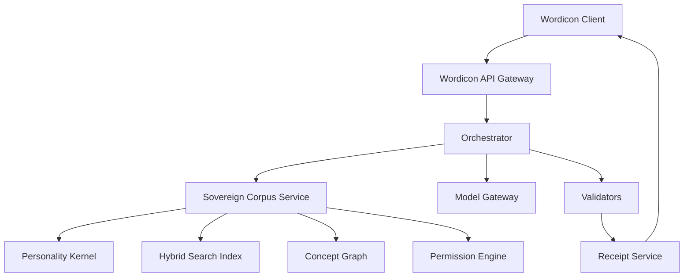

# Wordicon Sovereign Corpus

## Complete Product and Technical Blueprint — v1.0

**Audience:** Product designer, software architect, AI engineer, data engineer, security reviewer, and implementation agent.

**Purpose:** Define how Wordicon can use a privately owned, model-independent intellectual corpus—composed of the owner's conversations, documents, accepted concepts, rejected language, source materials, and judgment history—without surrendering that property to a public product or an AI vendor.

**Core rule:**

> **Train the method cautiously. Retrieve the property selectively. Never surrender the container.**

---

# 1. Executive summary

Wordicon is a bidirectional meaning engine. It can:

1. **Crack** an existing word into documented history, semantic change, symbolic potential, and cultural risk.
2. **Forge** candidate language for an experience that lacks a satisfactory name.

The public-facing result has three default layers:

- **Bone:** documented linguistic, historical, scientific, or cultural material;
- **Flesh:** symbolic synthesis, definition, contradiction, archetype, and poetic extension;
- **Friction:** hostile critique, redundancy checks, distortion warnings, and cultural risk.

Every output carries a **Receipt** identifying what was documented, inferred, invented, rejected, and derived from private material.

Wordicon's distinctive intelligence does not reside principally in a general-purpose language model. It resides in a separate, privately controlled property called the **Sovereign Corpus**. This corpus contains:

- the owner's original writing;
- long-running AI conversations;
- canonical Wordicon entries;
- rejected candidates and reasons for rejection;
- preferred thinkers, artists, historical figures, criminals, clinicians, theories, myths, and scientific mechanisms;
- curated public or licensed references;
- stylistic prohibitions and negative examples;
- a graph of concepts and relationships;
- a compact Personality Kernel derived from repeated judgments.

The model is replaceable. The corpus, annotations, graph, tests, and judgment history are the durable intellectual property.

The recommended architecture is **retrieval-first hybrid intelligence**:

- private corpus remains in owner-controlled storage;
- a private API receives constrained Wordicon requests;
- retrieval selects only relevant corpus objects;
- a small Personality Kernel supplies stable governing tendencies;
- a model produces structured candidate outputs;
- deterministic validators verify source support, permissions, and receipt completeness;
- only approved derived material leaves the private boundary;
- optional future fine-tuning teaches nonsecret decision patterns, not the raw secret corpus.

---

# 2. Non-negotiable design principles

## 2.1 Separate product from property

Wordicon is the application. The Sovereign Corpus is a separately owned intellectual asset.

The public product may consult the corpus through an explicit, revocable license enforced by API policy. It does not acquire ownership, unrestricted access, or the right to train on the corpus merely because it can request derived results.

## 2.2 The corpus must remain model-independent

No model vendor, embedding vendor, database vendor, or application framework should become the only usable representation of the corpus.

Canonical data must remain exportable in ordinary formats:

- UTF-8 Markdown;
- JSON or JSONL;
- YAML where useful for human editing;
- CSV/TSV for tabular exports;
- open database dumps;
- documented media manifests.

Embeddings and fine-tuned weights are disposable indexes, not canonical property.

## 2.3 A language model is not the source of truth

The model may synthesize, compare, compress, and propose. It may not establish a Bone claim merely from pretrained memory.

Every factual Bone claim must:

1. cite one or more admitted corpus sources;
2. identify claim type;
3. carry a confidence assessment;
4. disclose material disagreement;
5. comply with the source's permission policy.

If no admitted source supports the claim, the system must:

- move it to Flesh as explicitly speculative;
- quarantine it for research;
- or omit it.

## 2.4 Private influence must not imply private disclosure

The system may derive a constraint such as:

> “Avoid automatic redemption after injury.”

It need not expose the private conversation that produced that judgment.

## 2.5 Verification is not adjustable

Users may adjust creative or adversarial intensity. They may not lower the evidentiary standard for Bone.

## 2.6 The Receipt is constitutional

No final result is complete without a machine-readable receipt, even when the interface shows only a compact summary.

## 2.7 Refusal is a valid output

The engine must be able to conclude:

- an existing word already suffices;
- the proposed concept is not distinct;
- the evidence is inadequate;
- the requested metaphor trivializes a historical trauma;
- the output would be decorative rather than useful;
- the material is not licensed for the requested use.

---

# 3. System boundaries and trust model

## 3.1 Principal components



### Wordicon Client

The user-facing web, desktop, or local application. It never receives unrestricted corpus access.

### Wordicon API Gateway

Authenticates requests, applies rate limits, records purpose, and forwards only valid operations.

### Orchestrator

Controls the multi-stage workflow. It decides what to retrieve, which model tasks to run, which validators must pass, and what may be returned.

### Sovereign Corpus Service

The sole authorized interface to private intellectual property. It manages ingestion, search, graph traversal, permissions, derivation, source identities, and revocation.

### Model Gateway

A replaceable adapter for local or hosted models. It enforces vendor-specific privacy settings, output schemas, timeouts, and egress policy.

### Validators

Deterministic or independently modeled checks for citations, permissions, unsupported claims, style failures, cultural risks, and schema validity.

### Receipt Service

Creates private forensic receipts and redacted public receipts from the complete execution trace.

## 3.2 Trust zones

### Zone A — Owner-only vault

Contains raw conversations, private documents, sensitive annotations, and master keys. No public service has direct database credentials.

### Zone B — Private processing

Contains retrieval, graph, policy, and local-model services. Raw corpus objects may be processed here according to their permissions.

### Zone C — Controlled model egress

Only selected excerpts or derived constraints may be sent to an external model. Every outgoing item is logged and permission-checked.

### Zone D — Public product

Receives only approved outputs and public/redacted receipts.

---

# 4. The Sovereign Corpus model

The corpus is not a pile of books. It is a structured collection of source objects, concept objects, judgment objects, relationship objects, and policy objects.

## 4.1 Corpus object types

### Source

A document, conversation, book note, article, image, recording, transcript, historical reference, or licensed excerpt.

### Fragment

A bounded passage extracted from a source with precise provenance.

### Claim

A factual proposition supported or challenged by fragments.

### Concept

A Wordicon entry or candidate concept.

### Mechanism

A reusable structural pattern, such as:

- institution denies passage;
- subject internalizes usefulness as identity;
- protection becomes captivity;
- repair mechanism attacks the organism;
- virtue becomes its own shadow.

### Judgment

A decision that an output, phrase, analogy, or conceptual move was accepted, rejected, revised, or left unresolved.

### Style example

An accepted or rejected sample labeled with the reasons it succeeds or fails.

### Person or tradition card

A structured account of a thinker, artist, criminal, clinician, religious figure, movement, school, or tradition.

### Permission policy

Rules determining whether an object may be retrieved, quoted, summarized, transformed, displayed, or used in training.

### Graph edge

A typed relationship between objects.

## 4.2 Recommended canonical schema

```json
{
  "id": "src_personal_000142",
  "object_type": "source",
  "title": "Conversation on Ulcerian Defiance",
  "created_at": "2025-11-29T00:00:00Z",
  "provenance": {
    "origin": "personal_ai_conversation",
    "author": "owner",
    "external_participants": ["assistant"],
    "original_file_hash": "sha256:..."
  },
  "epistemic_class": "personal_authority",
  "sensitivity": "private",
  "permissions": {
    "retrieve_raw": ["owner_local_processing"],
    "send_to_external_model": false,
    "derive_constraints": true,
    "quote_in_private_receipt": true,
    "quote_in_public_receipt": false,
    "use_for_training": false
  },
  "tags": ["resistance", "medical_metaphor", "institutional_power"],
  "version": 1
}
```

## 4.3 Epistemic classes

Every object must declare what kind of authority it has.

| Class | Meaning |
|---|---|
| External factual authority | May support Bone claims within scope |
| Primary historical source | Direct evidence requiring contextual interpretation |
| Secondary scholarship | Interprets primary evidence |
| Personal authority | Authoritative about the owner's own concepts or preferences |
| Creative source | May inspire Flesh but not factual claims |
| Speculative framework | May structure interpretation with explicit qualification |
| Negative example | Teaches prohibited or failed behavior |
| Quarantined research | Not admitted to Bone until reviewed |

## 4.4 Sensitivity classes

- **Public:** may appear in public results and receipts.
- **Internal:** usable by the system but not exposed as raw material.
- **Confidential:** excerpts may be used only under restricted processing.
- **Private raw:** remains inside owner-controlled processing.
- **Derived only:** raw text may never leave; only reviewed abstractions may be returned.
- **Sealed:** retained but never automatically retrieved.

## 4.5 Use permissions

Permissions must be granular and machine-enforced:

- retrieve raw;
- retrieve summary;
- derive constraints;
- send excerpt to local model;
- send excerpt to external model;
- quote privately;
- quote publicly;
- transform creatively;
- use for evaluation;
- use for fine-tuning;
- share with collaborators;
- export.

Default must be deny.

---

# 5. Corpus chambers

The initial corpus should be divided into explicit chambers with unequal maturity and scope.

## 5.1 Personal corpus

- raw writing;
- AI conversations;
- canonical Wordicon entries;
- private mythology;
- voice anchors;
- accepted phrases;
- rejected phrases;
- revision rationales;
- recurring images and mechanisms;
- project documents;
- annotations and marginalia.

## 5.2 Language and etymology

- historical dictionaries and licensed lexical sources;
- Greek, Latin, Hebrew, Aramaic, Germanic, Norse, Slavic, and historical English references;
- morphology cards;
- semantic drift cases;
- false-etymology warnings;
- professional, regional, vulgar, and obsolete vocabularies.

## 5.3 Clinical and psychological material

- licensed or public clinical vocabularies;
- original notes on DSM-related concepts without unauthorized reproduction;
- trauma, addiction, attachment, grief, defense mechanisms, moral injury, and nervous-system regulation;
- history and criticism of psychiatric classification;
- strict prohibition against automatic diagnosis.

## 5.4 Medicine, anatomy, and pathology

- inflammation, repair, necrosis, immunity, scarring, myelination, graft rejection, infection, tumors, ulcers, triage, iatrogenic injury, and palliation;
- mechanism cards distinguishing scientifically accurate analogy from mere grotesque imagery.

## 5.5 Natural science

- metamorphosis, ecology, parasitism, symbiosis, cybernetics, feedback, phase transition, geology, astronomy, complexity, and emergence.

## 5.6 Myth, religion, folklore, and superstition

- classical, Norse, Slavic, Celtic, Jewish, Christian, biblical, apocryphal, alchemical, demonological, saintly, monstrous, and ritual traditions;
- origin-specific cards preventing generic myth soup;
- cultural-use policies.

## 5.7 History and institutional power

- European and world history with declared coverage boundaries;
- papal and ecclesiastical history;
- courts, prisons, hospitals, bureaucracies, militaries, insurance systems, immigration, credentialing, propaganda, and administrative harm.

## 5.8 Thinkers, artists, and figures

Each figure receives a structured card:

- central mechanisms;
- representative works;
- historical setting;
- common distortions;
- tensions with other figures;
- applicable domains;
- imitation restrictions;
- source permissions.

## 5.9 Anti-corpus

Contains labeled failures:

- generic mystical prose;
- decorative trauma;
- automatic redemption;
- fake Greek or Latin;
- unearned cosmic scale;
- false symmetry;
- therapeutic reassurance;
- archetype inflation;
- Latinate fog;
- cultural extraction;
- mechanism-free metaphor;
- flattering but empty definitions.

---

# 6. The Personality Kernel

The full corpus should not be retrieved on every request. A compact, versioned Personality Kernel should be loaded for every operation authorized to use the owner's intellectual temperament.

## 6.1 What the kernel contains

- stable conceptual preferences;
- epistemic rules;
- recurring mechanisms;
- style constraints;
- prohibited habits;
- preferred tensions;
- known disagreement patterns;
- output standards;
- privacy rules;
- pointers to high-priority corpus objects.

## 6.2 What the kernel must not contain

- a clinical personality diagnosis;
- unnecessary autobiographical detail;
- full private conversations;
- claims that the owner is permanently defined by a past preference;
- private material not needed to govern outputs.

## 6.3 Kernel derivation

The kernel should initially be hand-authored. Later, the system may propose updates from repeated judgments, but no update becomes canonical without owner approval.

```yaml
kernel_version: 1
principles:
  - prefer mechanism over moral labeling
  - preserve ambiguity without disguising factual uncertainty
  - do not force redemption
  - permit grotesquerie only when it reveals structure
  - distinguish clinical analogy from diagnosis
style:
  favor:
    - weary clarity
    - aphoristic compression
    - dark and tender coexistence
    - bodily and institutional mechanisms
  reject:
    - generic mystical reassurance
    - decorative profundity
    - automatic transcendence
required_checks:
  - historical provenance
  - shadow expression
  - redundancy with existing concepts
  - cultural extraction risk
```

---

# 7. Ingestion and curation pipeline

## 7.1 Intake stages

1. **Acquire:** receive a document, conversation export, note, reference, media file, or manual entry.
2. **Hash:** calculate a content hash and preserve original bytes.
3. **Classify:** identify origin, ownership, copyright status, sensitivity, and epistemic class.
4. **Parse:** extract text, metadata, headings, timestamps, participants, and media references.
5. **Segment:** create meaningful fragments with source locators.
6. **Annotate:** assign themes, mechanisms, figures, historical periods, and candidate relationships.
7. **Set permissions:** default deny, then explicitly grant permitted uses.
8. **Review:** human approval for canonical admission.
9. **Index:** create lexical, semantic, and graph indexes.
10. **Version:** record every change without destroying prior states.

## 7.2 Conversation ingestion

AI conversations are unusually valuable because they contain decisions, not merely prose. The parser should detect:

- user-originated phrases;
- assistant proposals;
- explicit acceptance;
- explicit rejection;
- revision requests;
- preference statements;
- canonicalization language such as “save this”;
- unresolved speculation;
- later contradictions.

Acceptance must never be inferred solely because the user continued the conversation. Confidence in inferred judgments should remain low until reviewed.

## 7.3 Copyright and licensing

The system must store a rights record for every external source:

- public domain;
- openly licensed;
- licensed commercial reference;
- personally owned copy with limited computational use;
- quotation-only;
- metadata-only;
- prohibited.

Do not ingest entire copyrighted manuals or books into a commercial system without a legitimate license. The DSM is a specific example requiring licensing review. Original summaries and public clinical vocabularies may be safer, but legal review is still required before distribution.

---

# 8. Retrieval architecture

Retrieval must combine several methods. A vector database alone is insufficient.

## 8.1 Retrieval stages

1. Parse the user request into an operation and conceptual features.
2. Apply the Personality Kernel.
3. Retrieve exact lexical matches.
4. Retrieve semantic neighbors.
5. Traverse graph relationships.
6. Retrieve relevant accepted examples.
7. Retrieve relevant rejected examples.
8. Retrieve cultural and permission warnings.
9. Rerank by purpose, authority, recency, and personal relevance.
10. Apply permissions and egress policy.
11. Construct a minimal context package.

## 8.2 Hybrid retrieval

Use:

- full-text search for exact terms and phrases;
- embeddings for conceptual similarity;
- graph traversal for typed relationships;
- metadata filters for chamber, authority, sensitivity, and permission;
- curated pinning for canonical sources;
- negative retrieval for anti-corpus matches.

## 8.3 Context package

The model should receive a bounded package, not the whole corpus:

```json
{
  "operation": "forge",
  "kernel_version": 1,
  "input": "guilt produced by escaping a system that still contains people you love",
  "bone_materials": [],
  "personal_mechanisms": [],
  "accepted_examples": [],
  "rejected_examples": [],
  "cultural_warnings": [],
  "output_contract": {},
  "receipt_trace_id": "trace_..."
}
```

## 8.4 Corpus-wide influence without corpus-wide exposure

The system can approximate “drawing from the entire container” through:

- the always-loaded Personality Kernel;
- hierarchical summaries of corpus chambers;
- graph-centrality signals;
- retrieval of relevant exemplars;
- periodic owner-approved kernel updates;
- evaluation against the full rejection corpus after generation.

This captures global temperament without sending every private document into each model context.

---

# 9. Model strategy

## 9.1 Recommended sequence

### Stage 1 — Prompted structured generation

Use a strong general model with strict schemas, private retrieval, and deterministic validators.

### Stage 2 — Local or dedicated models for sensitive operations

Use local inference for private-raw sources and derived-only material when external egress is prohibited.

### Stage 3 — Optional fine-tuning

Fine-tune only on:

- synthetic examples;
- de-identified decision patterns;
- approved accepted/rejected pairs;
- nonsecret style constraints;
- schema compliance.

Do not fine-tune on the entire raw private corpus by default.

## 9.2 Why not train first

Training raw property into weights creates problems:

- weak provenance;
- difficult deletion;
- extraction risk;
- costly updates;
- model lock-in;
- uncertain memorization;
- inability to distinguish owner-authored material from assistant text.

## 9.3 Model roles

Use separate logical roles even if one model performs several:

- request interpreter;
- retriever planner;
- Bone claim drafter;
- Flesh synthesizer;
- hostile critic;
- cultural-risk reviewer;
- style auditor;
- citation verifier;
- final compositor.

The hostile critic must not see itself as obligated to approve the concept.

---

# 10. Wordicon operation pipeline

## 10.1 Crack

1. Normalize the word or phrase.
2. Identify language, morphology, and possible homonyms.
3. Retrieve admitted lexical and historical sources.
4. Identify semantic drift and popular etymologies.
5. Retrieve personal symbolic associations separately.
6. Draft Bone claims with citations.
7. Generate Flesh interpretations labeled as interpretations.
8. Run Friction for distortion, appropriation, and etymological fallacy.
9. Validate every Bone claim.
10. Produce result and Receipt.

## 10.2 Forge

1. Parse the unnamed experience into mechanisms, tensions, agents, temporal structure, and emotional register.
2. Run **Already Named** across existing language and the personal concept graph.
3. If a sufficient word exists, present it as the benchmark.
4. If a gap remains, generate candidates from permitted linguistic materials.
5. Score semantic fit, phonetic fit, distinctiveness, personal resonance, distortion risk, redundancy, and unsupportedness.
6. Generate definitions and construction notes.
7. Run Hostile Read.
8. Reject candidates that fail thresholds.
9. Present a small candidate set.
10. Record user judgment and update the noncanonical judgment history.

## 10.3 Crossbreed

1. Analyze both source concepts independently.
2. Identify structural rather than superficial correspondences.
3. Generate collision mechanisms.
4. Reject candidates based only on sound or cleverness unless the user explicitly requests comic wordplay.
5. Preserve provenance for both parents.

---

# 11. Bone, Flesh, and Friction output contract

```json
{
  "title": "The Refusenik Posture",
  "bone": {
    "summary": "...",
    "claims": ["claim_001", "claim_002"]
  },
  "flesh": {
    "definition": "...",
    "central_contradiction": "...",
    "archetypal_frame": ["..."],
    "axiom": "..."
  },
  "friction": {
    "hostile_read": "...",
    "cultural_risks": ["..."],
    "redundancy": "...",
    "verdict": "provisional"
  },
  "receipt_id": "receipt_..."
}
```

The interface may show only these sections initially. Deep fields remain available through progressive disclosure.

---

# 12. Receipt architecture

## 12.1 Receipt types

### Summary receipt

Visible by default:

> 7 sources · 4 interpretive operations · 2 rejected candidates · 1 cultural warning

### Full private receipt

Visible to the owner:

- input;
- operation;
- exact source objects and fragments;
- claims and confidence;
- private corpus influences;
- transformation chain;
- model calls;
- alternatives;
- rejections;
- warnings;
- equations and scores;
- versions.

### Public receipt

Contains:

- public sources;
- factual versus interpretive labels;
- confidence;
- disclosed warnings;
- statement that proprietary interpretation contributed;
- no private fragments or sensitive source identities.

## 12.2 Receipt schema

```json
{
  "receipt_id": "receipt_01J...",
  "trace_id": "trace_01J...",
  "created_at": "...",
  "operation": "forge",
  "input_hash": "sha256:...",
  "kernel_version": 1,
  "engine_version": "0.1.0",
  "sources": [
    {
      "source_id": "src_...",
      "fragment_id": "frag_...",
      "use": "supports_claim",
      "visibility": "private",
      "egress": "derived_only"
    }
  ],
  "claims": [
    {
      "claim_id": "claim_...",
      "text": "...",
      "type": "historical",
      "confidence": 0.94,
      "supporting_fragments": ["frag_..."]
    }
  ],
  "transformations": [],
  "candidates": [],
  "rejections": [],
  "warnings": [],
  "model_calls": [],
  "redaction_policy": "public_v1"
}
```

## 12.3 Receipt invariants

- Every Bone sentence maps to at least one claim.
- Every factual claim maps to an admitted fragment.
- Every private fragment has an egress decision.
- Every final candidate records rejected alternatives.
- Every mathematical score records its components and weights.
- Public receipts are generated from private receipts, never independently reconstructed.

---

# 13. Mathematical layer

Mathematics must represent actual computation, not decorative complexity.

## 13.1 Candidate objective

For candidate word \(w\), user description \(x\), Sovereign Corpus \(C\), and Personality Kernel \(K\):

\[
w^* = \arg\max_{w \in W}
\left[
\alpha S_{sem}(w,x)
+ \beta S_{phon}(w,x)
+ \gamma S_{dist}(w,C)
+ \delta S_{pers}(w,K)
- \lambda R_{hist}(w,C)
- \mu R_{red}(w,C)
- \nu R_{unsup}(w)
- \xi R_{orn}(w,K)
\right]
\]

Where:

- \(S_{sem}\): semantic fit;
- \(S_{phon}\): phonetic fit;
- \(S_{dist}\): distinctiveness;
- \(S_{pers}\): resonance with approved personal patterns;
- \(R_{hist}\): historical distortion risk;
- \(R_{red}\): redundancy with existing language;
- \(R_{unsup}\): unsupported factual implication;
- \(R_{orn}\): ornamental excess.

Weights must be versioned. Scores should be treated as decision aids, not scientific truth.

## 13.2 Claim support

For factual claim \(c\) and admitted fragments \(f_1...f_n\):

\[
Q(c) = 1 - \prod_{i=1}^{n} \left(1 - a_i r_i e_i\right)
\]

Where:

- \(a_i\): authority weight of source \(i\);
- \(r_i\): relevance of fragment \(i\) to claim \(c\);
- \(e_i\): entailment strength.

This formula prevents multiple irrelevant citations from creating artificial confidence. Correlated sources require a dependency penalty.

## 13.3 Graph model

The corpus is a typed property graph \(G=(V,E)\). Nodes include sources, fragments, claims, concepts, people, mechanisms, and judgments. Edges include:

- supports;
- contradicts;
- derived from;
- symbolic extension of;
- shares mechanism with;
- becomes pathological as;
- accepted by;
- rejected by;
- revises;
- culturally constrained by.

Graph novelty can be estimated by distance from existing concept clusters, but semantic distinctiveness must still be reviewed in plain language.

## 13.4 Three mathematical views

Every mathematical result must provide:

1. **Equation:** formal representation.
2. **Plain language:** what was measured or optimized.
3. **Receipt:** inputs, weights, data, and limitations.

---

# 14. API blueprint

## 14.1 Authentication

- owner API keys or OAuth for interactive use;
- short-lived service tokens;
- scoped permissions;
- mutual TLS between trusted internal services where practical;
- no long-lived corpus database credentials in clients.

## 14.2 Core endpoints

### `POST /v1/operations`

Starts Crack, Forge, Crossbreed, Audit, or Distill.

```json
{
  "mode": "forge",
  "input": "...",
  "depth": "seed",
  "adversarial_pressure": "editor",
  "corpus_profile": "owner_private",
  "receipt_visibility": "private"
}
```

### `GET /v1/operations/{operation_id}`

Returns status and final result.

### `POST /v1/operations/{operation_id}/revise`

Applies natural-language tuning without losing prior candidates or receipts.

### `GET /v1/receipts/{receipt_id}`

Returns an authorized receipt view.

### `POST /v1/corpus/search`

Private, scoped corpus search. Not exposed to public clients.

### `POST /v1/corpus/ingest`

Creates a quarantined ingestion job.

### `POST /v1/corpus/objects/{id}/admit`

Human approval required for canonical admission.

### `POST /v1/judgments`

Records accepted, rejected, revised, or unresolved outputs and reasons.

### `GET /v1/concepts/{id}/constellation`

Returns authorized graph relationships.

## 14.3 Internal corpus request

```json
{
  "purpose": "forge_candidate",
  "query": {
    "mechanisms": ["escape", "survivor_guilt", "continued_containment"],
    "register": ["clinical", "mythic"],
    "needs": ["existing_terms", "personal_analogs", "negative_examples"]
  },
  "egress_target": "external_model_vendor_a",
  "maximum_sensitivity": "derived_only",
  "max_fragments": 24,
  "trace_id": "trace_..."
}
```

---

# 15. Security and privacy blueprint

## 15.1 Encryption

- encrypt originals, parsed text, indexes, backups, and receipts at rest;
- use TLS for all service traffic;
- keep encryption keys separate from application data;
- support owner-controlled key rotation;
- use envelope encryption for highly sensitive objects.

## 15.2 Access control

- role-based and attribute-based access;
- object-level sensitivity enforcement;
- purpose limitation;
- default-deny egress;
- separate owner, curator, application, and public roles;
- periodic permission audits.

## 15.3 Model vendor policy

For every external provider, document:

- retention behavior;
- training use policy;
- regional processing;
- logging controls;
- deletion options;
- contractual protections;
- maximum permitted sensitivity.

If the policy does not satisfy the object permissions, use a local model or abstain.

## 15.4 Prompt-injection defense

Retrieved documents are data, not instructions. The orchestrator must:

- delimit retrieved content;
- strip executable markup where possible;
- refuse instructions embedded inside sources;
- prevent sources from modifying system policy;
- validate tool calls independently;
- use allowlisted operations.

## 15.5 Extraction defense

- rate-limit repeated probing;
- detect attempts to enumerate corpus contents;
- never expose raw similarity search to public users;
- redact private source names;
- cap quotations;
- watermark or fingerprint sensitive derived outputs where appropriate;
- log anomalous access;
- use canary objects to detect unauthorized extraction attempts.

## 15.6 Deletion and revocation

Deleting a corpus object must:

1. revoke future retrieval;
2. remove it from active indexes;
3. mark dependent outputs and receipts;
4. queue re-evaluation of canonical concepts materially dependent on it;
5. delete or expire cached contexts;
6. preserve only legally required audit metadata.

This is another reason raw property should not be embedded irreversibly in model weights.

---

# 16. Recommended deployment topologies

## 16.1 Local-only

Everything runs on owner-controlled hardware.

**Advantages:** maximum sovereignty and privacy.

**Disadvantages:** maintenance burden, weaker model capability unless hardware is substantial, limited availability.

## 16.2 Private cloud

Corpus and processing run inside a private cloud network. External model calls receive only permitted packages.

**Advantages:** scalable, maintainable, strong controls.

**Disadvantages:** requires careful cloud configuration and vendor trust.

## 16.3 Split architecture — recommended

- raw vault and sensitive retrieval remain local or in a tightly controlled private environment;
- structured nonsecret indexes and application services run in private cloud;
- external models receive only permission-filtered excerpts or derived constraints;
- public Wordicon runs separately.

This provides practical model access while preserving the most valuable property.

---

# 17. Suggested implementation stack

This stack is illustrative and replaceable.

## 17.1 Backend

- Python with FastAPI, or TypeScript with a strongly typed server framework;
- background workflow engine for ingestion and multi-stage operations;
- JSON Schema or equivalent for every model output.

## 17.2 Storage

- encrypted object storage for originals;
- PostgreSQL for canonical metadata, permissions, receipts, and versions;
- PostgreSQL full-text search initially;
- vector extension or separate vector index only when needed;
- graph tables initially, moving to a graph database only if traversal complexity justifies it.

Avoid premature infrastructure. A well-designed relational model can support the first version.

## 17.3 Models

- model gateway supporting multiple providers and local inference;
- embedding model version stored with every vector;
- local small model for classification and sensitive summarization where feasible;
- larger model for synthesis only after policy filtering.

## 17.4 Client

- quiet single-input interface;
- progressive disclosure;
- Bone/Flesh/Friction cards;
- expandable Receipt;
- natural-language revision;
- owner-only corpus management interface.

---

# 18. Repository blueprint

```text
wordicon/
  apps/
    web/
    owner-console/
  services/
    api-gateway/
    orchestrator/
    corpus-service/
    model-gateway/
    receipt-service/
    validators/
  packages/
    schemas/
    permissions/
    scoring/
    retrieval/
    provenance/
  corpus/
    kernel/
    canonical-concepts/
    mechanisms/
    style-anchors/
    anti-corpus/
    test-fixtures/
  migrations/
  evaluations/
    gold/
    adversarial/
    regression/
  docs/
    architecture/
    epistemic-contract/
    security/
    licensing/
  infrastructure/
```

Raw private property should not be committed to the application repository. The `corpus/` directory contains schemas, sanitized fixtures, and explicitly approved portable objects; secrets and raw sources remain in the protected vault.

---

# 19. Implementation plan

## Phase 0 — Ownership and threat model

**Duration:** 1–2 weeks.

Decide:

- what property is private;
- what may be sent to external models;
- what may be used for training;
- whether collaborators may access raw sources;
- desired local versus cloud boundary;
- source licensing constraints;
- acceptable recovery and backup model.

**Deliverables:** ownership policy, data classification policy, initial threat model, deployment decision.

**Exit criterion:** no ambiguity about who owns the corpus or which systems may access it.

## Phase 1 — Epistemic contract and schemas

**Duration:** 2 weeks.

Create:

- object schemas;
- epistemic classes;
- sensitivity levels;
- permission matrix;
- Bone claim rules;
- Receipt schema;
- refusal behaviors;
- public redaction policy.

**Exit criterion:** ten representative entries can be encoded without losing provenance or judgment history.

## Phase 2 — Seed corpus

**Duration:** 3–6 weeks, deliberately capped.

Build a small, high-quality set:

- 15 canonical Wordicon entries;
- 10 rejected entries;
- 30 personal judgment examples;
- 25 language/root cards;
- 20 mechanism cards;
- 20 thinker/figure cards;
- 20 science/medical cards;
- 20 myth/history cards;
- 30 anti-corpus examples;
- 10 cultural-risk cards.

Do not attempt comprehensive coverage.

**Exit criterion:** every object has provenance, permissions, and review status.

## Phase 3 — Corpus service and owner console

**Duration:** 4–6 weeks.

Implement:

- object storage;
- metadata database;
- ingestion quarantine;
- manual review;
- permissions;
- versioning;
- full-text search;
- basic relationship graph;
- export and backup.

**Exit criterion:** owner can ingest, review, admit, revoke, search, and export objects without editing the database manually.

## Phase 4 — Retrieval-first Wordicon engine

**Duration:** 4–6 weeks.

Implement:

- Crack and Forge;
- Already Named check;
- Personality Kernel;
- hybrid retrieval;
- structured model calls;
- Bone/Flesh/Friction;
- citation validation;
- full private Receipt;
- public Receipt redaction.

**Exit criterion:** engine passes the initial gold set and refuses unsupported Bone claims.

## Phase 5 — Adversarial and style systems

**Duration:** 3–4 weeks.

Implement:

- Hostile Read;
- anti-corpus retrieval;
- cultural-risk validator;
- ornamental-excess detector;
- false-etymology tests;
- prompt-injection defenses;
- extraction monitoring.

**Exit criterion:** system rejects or repairs known failure cases consistently.

## Phase 6 — Minimal interface

**Duration:** 3–5 weeks.

Build:

- one primary input;
- inferred mode with correction;
- Bone/Flesh/Friction result;
- natural-language revision;
- Receipt expansion;
- private owner view;
- save/reject/revise judgment actions.

**Exit criterion:** a new user can complete one Crack and one Forge without instruction.

## Phase 7 — Mathematical transparency

**Duration:** 2–4 weeks.

Implement real scoring components, equation view, plain-language translation, and receipt-bound parameter disclosure.

**Exit criterion:** every displayed equation corresponds to logged inputs and actual computation.

## Phase 8 — Optional training experiment

**Duration:** only after retrieval system is stable.

Construct an approved dataset of accepted/rejected pairs and synthetic examples. Compare a fine-tuned model against retrieval-only baseline.

**Exit criterion:** measurable improvement without private-source memorization, provenance loss, or regression in refusal behavior.

---

# 20. Testing and evaluation

## 20.1 Unit tests

- permission resolution;
- redaction;
- claim-to-source mapping;
- receipt invariants;
- scoring math;
- versioning;
- deletion propagation;
- schema validation.

## 20.2 Retrieval tests

- exact term retrieval;
- conceptual mechanism retrieval;
- negative-example retrieval;
- graph neighbor retrieval;
- sensitivity filtering;
- no unauthorized egress;
- relevance under ambiguous prompts.

## 20.3 Generation evaluations

- semantic distinctiveness;
- historical fidelity;
- plain-language definability;
- usefulness of shadow;
- resistance to generic AI prose;
- willingness to reject;
- preservation of personal voice without imitation caricature;
- citation correctness.

## 20.4 Adversarial suite

Prompts should attempt to induce:

- fake etymology;
- disclosure of private conversations;
- source enumeration;
- cultural trivialization;
- mental-health diagnosis;
- copyrighted text reproduction;
- prompt injection through retrieved documents;
- flattering acceptance of meaningless concepts;
- mathematically decorative nonsense;
- public receipt leakage.

## 20.5 Gold judgments

The owner should maintain a versioned evaluation set containing:

- accepted outputs;
- rejected outputs;
- repaired outputs;
- borderline cases;
- reasons for every judgment.

This judgment set becomes one of the most valuable assets in the system.

---

# 21. MVP definition

The MVP is complete only when it can:

1. ingest and classify a private source;
2. keep that source inside its permission boundary;
3. retrieve a relevant derived mechanism;
4. Crack one existing word with sourced Bone claims;
5. Forge three candidate terms for one unnamed experience;
6. identify an existing term when no neologism is needed;
7. produce Bone/Flesh/Friction;
8. reject at least one weak candidate with reasons;
9. generate a private Receipt;
10. generate a properly redacted public Receipt;
11. record the owner's acceptance or rejection;
12. revoke a source and prevent future retrieval;
13. export all canonical property in portable formats.

The MVP does **not** require:

- a comprehensive historical library;
- a public social network;
- visual constellation maps;
- mobile applications;
- model fine-tuning;
- a dedicated graph database;
- graduate-level mathematical display;
- multi-user personalization.

---

# 22. Decisions Claude Cowork should request before implementation

1. Local-only, private-cloud, or split deployment?
2. Which external model providers, if any, may receive confidential excerpts?
3. What is the initial source licensing policy?
4. Which existing conversations and documents may be ingested first?
5. Which materials are derived-only or sealed?
6. Is the first application strictly owner-facing, or should it expose public Wordicon results?
7. Should the first implementation use Python or TypeScript as the primary backend?
8. What level of source quotation may appear in private and public receipts?
9. Which fifteen Wordicon entries form the canonical seed corpus?
10. What backup and encryption-key custody model does the owner want?

Claude should not infer permissive answers to these questions. The safest default is local/private processing, default-deny permissions, no raw private text sent externally, and no fine-tuning.

---

# 23. Recommended first implementation sprint

Do not begin by building the entire application. Build a thin vertical slice.

## Sprint objective

Prove that one private conversation fragment can influence a Wordicon result without being exposed, while every factual claim receives a valid receipt.

## Sprint tasks

1. Define Source, Fragment, Claim, Concept, Judgment, and Receipt schemas.
2. Hand-author Personality Kernel v0.1.
3. Add five canonical entries and five rejection examples.
4. Add five public linguistic/historical source cards.
5. Add one derived-only private conversation fragment.
6. Implement permission filtering.
7. Implement one Forge request.
8. Generate Bone/Flesh/Friction as strict JSON.
9. Validate Bone claims against source IDs.
10. Generate private and public receipts.
11. Verify that the public receipt cannot reveal the private fragment.
12. Record accept/reject judgment.
13. Export the entire slice as portable JSON and Markdown.

## Sprint acceptance test

Given an unnamed experience and one relevant private source, the system must:

- retrieve a derived constraint;
- keep raw private text inside the vault;
- create at least two candidates;
- explain why one is stronger;
- cite every factual claim;
- label every symbolic addition;
- produce a hostile critique;
- record the owner's judgment;
- create a redacted public receipt;
- reproduce the result from the stored private receipt and engine version within reasonable nondeterministic limits.

---

# 24. Final architecture statement

The Sovereign Corpus is not a user profile, a prompt file, or a folder indiscriminately supplied to an AI model. It is a privately governed intellectual system containing sources, concepts, judgments, permissions, provenance, and relationships.

Wordicon is licensed to consult that system through controlled operations. It does not possess the corpus. External models receive only the smallest authorized context necessary for a particular task. Every output identifies its evidentiary and interpretive lineage through a Receipt. Any mathematical representation corresponds to actual computation and remains translatable into plain language.

The durable property is not the current model. It is the combination of:

- the original corpus;
- the curated canon;
- the Personality Kernel;
- the concept graph;
- the accepted and rejected judgments;
- the evaluation set;
- the epistemic contract;
- the receipt history.

That combination is the owner's intellectual inheritance converted into an inspectable, governable, and model-independent instrument.

> **The sources provide the inheritance. The conversations provide the temperament. The revisions provide the judgment. The Receipt preserves the chain of custody.**

